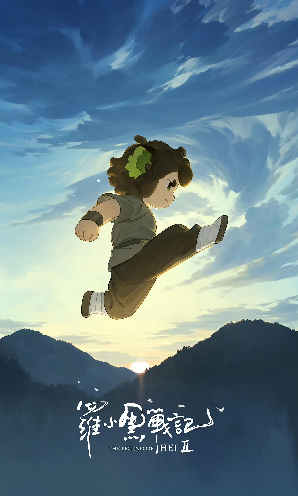
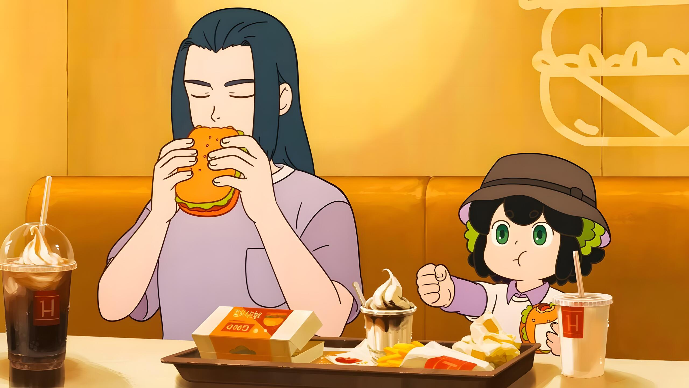
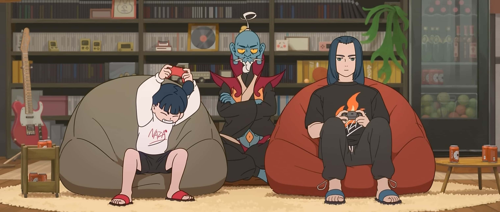
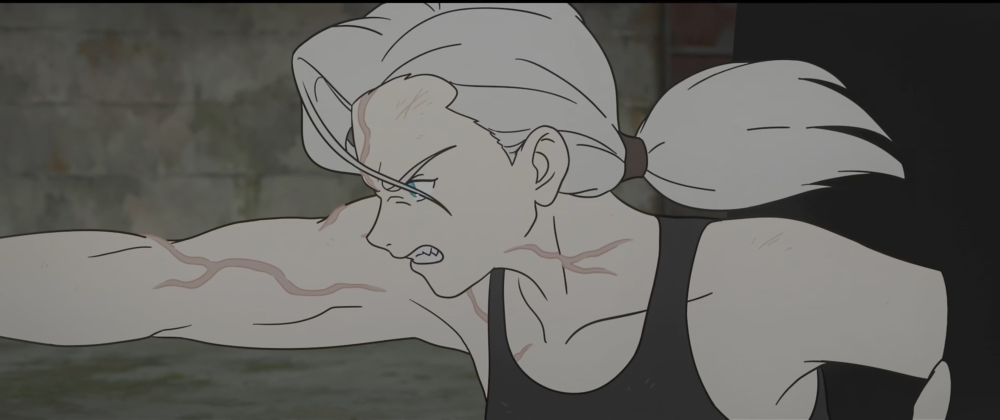
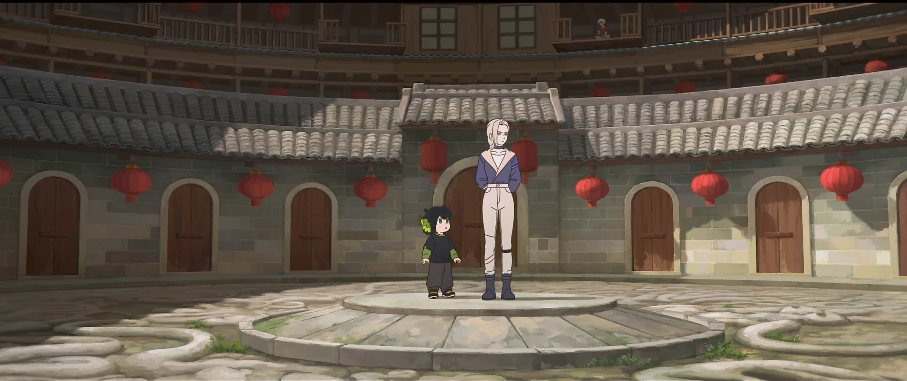
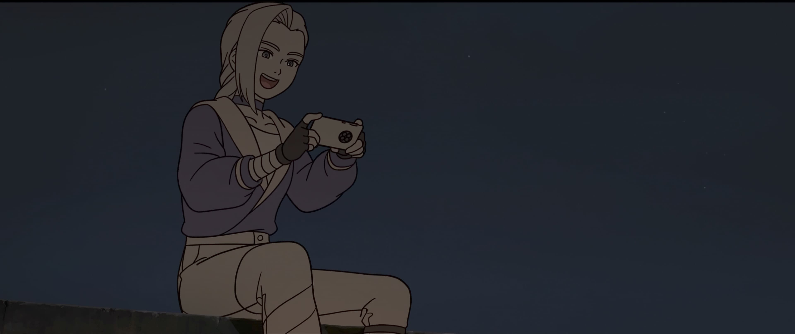

## 前言

不需要冠以国漫前缀限制的好电影

> 怎么票房只有5亿多，在我心中比某百亿票房电影冠军好太多了...
> 
> 非常后悔当时没去电影院享受大荧幕贡献票房

## 生活，是日常

学生时代，我的生活常常是节点式的，仿佛当下的生活意义就是为了那个里程碑的圆满（比如高考），这种心态的负面影响是，我常常认为当下的生活是一种临时性的，更多的延迟满足会放在里程碑事件之后。可这常常是虚妄的，这种心态本就决定了一个里程碑后还有一个新的里程碑，然后反复焦虑，在无聊和欲望之间反复拉扯。

可时光和经历终究会慢慢揭示，许多目标只是被他者、社会甚至自己潜移默化灌输的，并非主动选择的。一个人真正的呼召calling，或许还需要很多次一时兴起的尝试，数十年的坚持才能慢慢寻到。

而无论有无目标，生活的真正所在其实是日常：是你难眠多想的深夜，是你懵懂清晨的懒腰，是早餐一碗素面，是夜间与朋友吃饭，是你独自探索世界，是你和伙伴并肩作战。

这也是我喜欢罗小黑的地方，电影里的过场分镜，有很认真地描写我们生活中真的会出现的日常，并且妖怪们都在认真地享受当下。在灵力凋零的末法时代（什么人口老龄化危机），把现代科技巧妙装点进了这个奇幻世界中。

比如无限和小黑一起吃麦当劳

以及哪吒在游戏中被暴打不服气

在电影尾声小黑认真地和师傅讨论吃冰淇淋，无限回答地很认真不敷衍（什么现代教育指南）。这些细节背后透露地无不是对日常的关切。就像泡面番的起源一样：我们看中吃饭的这一刻，找一部可爱的作品陪伴孤单的自己度过这个美妙的日常。

## 顶级动作戏和典雅国漫风

动画的优势在于不必受实拍物理法则的约束，因此常常有充满张力的夸张画面，烙印在观众心中。而从观众角度来看，谁没有幻想过自己控制烈焰飞天遁地之类的中二场景呢，而这些都能够在动画中圆梦。

优秀的动作戏，是顶级技术力与美学的表现，是创作者和观众的双向奔赴，更是情节叙事和世界构建的需要。在这一点，这部电影惊喜到令观众有些眼花缭乱。 

划重点：皆逆荒、鹿野、小黑的追逐戏 & 鹿野+小黑 vs. 灵瑶帮

动漫作为文艺作品，带有当地文化的特色烙印是必然的，这也是日本文化通过动漫在英文世界奠定统治级地位的原因之一，现代文艺作品永远是最好的文化输出载体。而做到这一点，就必须对传统文化进行现代化改造，去芜存菁，把各种经典的美丽意象普及开来。

罗小黑的国漫底色也非常丰富：无限田园养鸡、哪吒居所的园林、灵瑶提起袖子准备茶艺、各种会馆闪过的大好河山、粤东菜馆的盛宴不一而足。

连人物名都值得细细咀嚼：鹿野、池年、西木子、皆逆荒（明明只是随机汉字组成的名字但就是很有逼格是怎么回事），这大概是独属于汉字的魅力了。

## “正常”的人物塑造

被生活捶打多年，常年龟缩在房间电脑前，我身为人本真的感知和表达能力其实弱化很多了。罗小黑本喵对万物近乎直觉式的反应：对长辈的尊敬、参观科技馆的好奇、对师姐不对的反抗、知晓师姐身世时的眼泪、看电影被吓到时的惊恐、起床被吵醒的懵圈、暴打师傅的大笑。这些情感对我来说太宝贵了，令我这个死人微活。

整部电影中，没有屎尿屁、暴力、厌女的奇怪笑点，笑点都非常的自然、可爱、出奇不意。继承第一部也没有任何说教意味，无限的教育理念一直是小黑可以有自己的答案，就连鹿野都不曾改变保护妖精的立场。

最触动我的，仍然是这个在动漫领域稀少到有点吃惊的大女主形象：鹿野。不搞擦边，初见就干净利落一女的，自身实力极强，战损也不爆衣，酒店休息时有女性特质，小黑不跟着走也不惯着，不乏对小黑和师傅的温情。即使电影最后谈及她的过往也只是蜻蜓点水，不苦大仇深地渲染。她的角色魅力不同于过往的女角色由外貌先决定80%，绝大部分是由行为和情节塑造的。

此外，群像的精彩令这个世界活色生香：霸气威武的池年，随意散漫的哪吒，关键时刻可靠的的甲和乙、甚至爱打麻将的校长，稳重外交的老潘、调停讲理的西木子、更不用说许多只出现几帧的高辨识度路人角色。

这些正常太宝贵了，曾经大家都想猎奇，所以电影呈现的必须是奇观，而现在猎奇在掌心随时随地触手可得，纯粹的为人与生活才是这个时代的“奇观”。

## 举重若轻的反战内核

不同于TV中用游戏替代真实死亡的逃避，开局五分钟是展现的是真正的破碎，是X战警式的人妖共存危机。

关于政治，我不喜欢言说，总归是利益与观念的妥协。大家都信奉拳头即是正义的时候，和平就需要强者的主动。每个人并不总是强者，也总有自己想要守护的人，因此战争永远是需要极力避免的。或许无限最后的平移放烟花就是对战争的叹息，总归还是需要更大的拳头么？

## 罗小黑的世界

因为中了罗小黑的毒，我在看完后立刻二刷+重看1+看动画+看漫画+翻官方微博，一周内看完了MTJJ十几年的作品，意犹未尽。

> 虽然1作画上稍显稚嫩，动画和漫画情节偏低幼

更不用说同人们的产粮和官方微博现场补充设定了。

我能感受到创作者们是爱着笔下的角色和世界的，这是作为观众幸福的瞬间。

## 个人小吐槽

战力崩坏自不用提，我主要在意的点是作为大反派的灵遥自身战技寥寥，主要在用大松的法器，和人类的交易细节也很少。

音乐相比动作戏没有那么惊艳

## 尾声

大圣归来、大鱼海棠、长安三万里、雄狮少年1&2、浪浪山小妖怪、罗小黑战记2...

虽然一直自嘲是假二次元，但对动画的狂热还是让我基本没落下每一部重要的国漫电影。而到今天，我觉得看罗小黑有一种当年第一次看机器人总动员的感动，老少咸宜，宜反复欣赏。

希望国漫越来越好！

> 木头可不可以把电影先搁置一下，这个大个罗小黑世界，随便挑些妖怪写点日常把更新速度提上来好吗？我提议鸠老和若水的日常！

---
图片来自电影截图

> 作为ADHDer，写影评就是这么的离散。