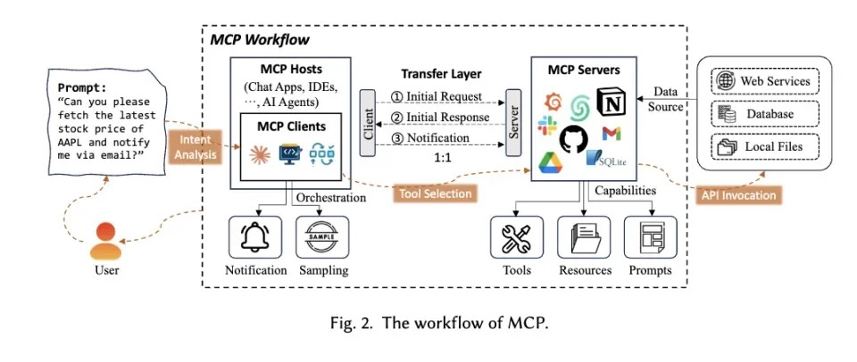
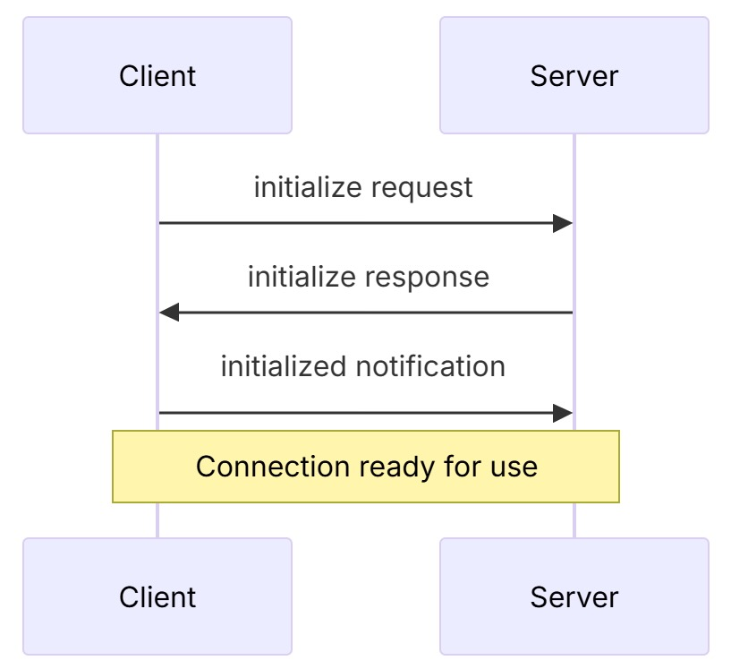

## MCP

Model Context Protocol, 模型上下文协议，Agent 工具调用的统一协议，AI 生态的底层标准

解决问题：每个 LLM 使用不同的指令格式，每个 API 也有独特的数据结构

技术架构：

* MCP Host：用户直接交互的 AI 终端，比如 ChatBot, IDE, agents
* MCP Client：LLM 建立第三方服务的 MCP 客户端
* MCP Server：第三方服务通过 MCP 服务端提供 API 能力（contexts, tools, prompts）
    可能调用本地数据源或其他远程服务

MCP是通信标准，可以支持function call（大模型能力）
问题：
●对于企业服务提供商，维护 MCP Server 适配层只是增加成本
●缺乏评价机制，选择调用哪个MCP Server缺乏依据
●对于常用软件，大部分工具都是由开发者写好，很少调用第三方（极小众垂直领域例外）
目前无官方 Golang mcp sdk 实现
MCP 协议核心组件：
●Protocol Layer：处理消息分片，请求/回复处理，通信模式等（Session 类）
●Transport Layer：实际通信，Stdio & SSE，使用 JSON-RPC 2.0 标准协议，Transport 层负责 JSON-RPC 和各 SDK 的 MCP protocol messages 的转换
json-rpc 相比 ProtoBuf 体积更小，网络传输效率更高
●Message Type：Requests, Responses (Results or Errors), Notifications (Either direction)

Initialization

client / server 都可以 terminate

MCP Servers 主要提供三种能力：

1.Resources：数据，API 返回结果或者文件内容
2.Tools：函数，执行某些特定操作
3.Prompts：某些完成特定任务的特殊文本

最佳实践：

●本地集成MCP和cmd tools使用操作系统进程的 stdio 管道，stdin发送请求，stdout接收响应，依赖两个独立单向管道模拟双向通信，同步阻塞模型，不支持高并发
●远程、web应用、需要stateful sessions来保留上下文、断连可恢复，使用 streamable http，考虑 authentication 和 authorization
○Client-to-server: keep-alive 复用 TCP连接的 http post request，有session ID作为凭证，服务器不维护长连接，client发送到 /message 端点
○Server-to-client: json response 或者升级为 SSE分块推送数据，与post请求通道分离
○Last-Event-ID 和 Mcp-Session-Id header 可以用于断线重连
●sse transport 逐步deprecate了，建议使用streamable http
可自定义 transport 层，注意连接错误、消息转译错误、协议错误、网络超时、资源清理
安全考量：始终验证 Origin header 来防止 DNS rebinding attacks
利用 DNS 解析机制绕过浏览器同源策略的网络攻击技术
Roots 是 client 告知 servers 可操作资源的 URI，文件系统路径和 http 路径都可以，最小暴露原则，并监控使用情
Roots 用例：
1.AI IDE 的项目目录
2.仓库地址
3.API 地址
4.配置地址
Sampling：加上 Client 端的风控
LangChain
提供 Python 和 JS 接口
Agent 开发框架：支持链式任务编排、记忆管理、RAG等
MCP 可作为底层工具集成协议
特性说明：Fake LLM（测试），缓存，用量记录，各种文档加载器，向量索引，人在回路
Loader => Document Loader => Text Splitter => Vector Stores（向量化数据）=> Chain（任务）=> Agent（调用 Chain）=> Embedding（衡量文本相关性）
支持第三方插件
生态其他产品（都是商业付费产品）：
●LangGraph：复杂任务编排，基于有向无环图 DAG
●LangSmith：全链路可观测平台
