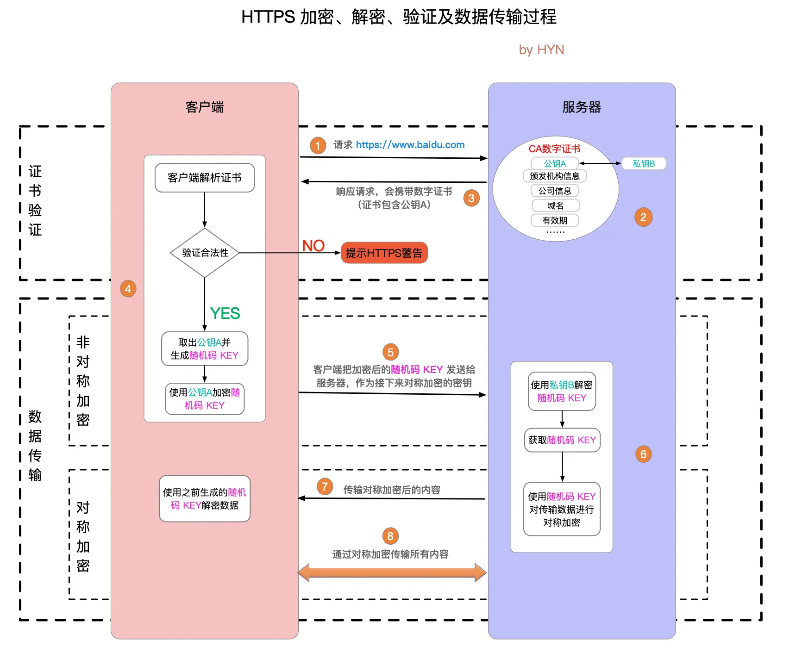

## OS-基础

操作系统是计算机硬件和应用软件的中间层系统软件。主要功能包括**进程管理、内存管理、文件系统管理、设备管理**等

虚拟机将计算机虚拟到硬件层；容器只虚拟到操作系统以上的软件层。

容器虚拟化是通过 namespace（隔离）+ cgroups（IO、CPU、内存资源控制）+ UnionFS（文件分层） 在操作系统层实现的轻量级虚拟化。它本质上只是运行在宿主机上的受限进程，而不是虚拟机。

KVM: 将Linux自身转变成虚拟机监控程序，cgroup用来限制进程使用资源

```bash
# Linux常见命令
# 状态
top
# 查看CPU核心总数
nproc
# 可与grep配合查看某端口连接数和状态
ps aux | grep

# 网络
netstat
ping
# 网卡信息
ifconfig
wget
kill -9 PID
df
# 捕获显示数据包信息
tcpdump
# DNS查询
dig/nslookup
# 防火墙
iptables
# 显示目录磁盘使用情况
du
# 显示内存和交换空间使用情况
free
# 文件相关
pwd
mkdir
rm
mv
# rwxa421ugo
chmod
find . -name "a.txt"
unzip
tar
# 定期执行指定命令，并将结果实时显示到终端中，默认2秒1次
# 可与netstat结合查看特定端口qps
watch
# 复杂文本处理
awk
# 跟踪系统调用和信号传递
strace
# 查看给定时间间隔整个服务器的各项状态指标
vmstat
# display free disk space
df
# list open files，Linux万物皆文件，因此可用来查找端口占用
lsof
```

多路复用：通过单个线程同时监控多个I/O流，通过就绪通知避免阻塞等待

Linux I/O多路复用的三种机制

* select：fd_set（bit_map）数组存储文件描述符集合，select内核会遍历fd。（文件描述符最大1024，用户态拷贝到内核态）
* poll：poll_fd（结构体数组，大小理论上仅受机器内存限制）链表存储文件描述符集合，同样需要拷贝和遍历，但文件描述符不限
* epoll（目前Linux使用）：使用 `epoll_wait` 等待文件描述符就绪，内核通过回调机制直接通知就绪的文件描述符（有通知一次（边缘触发）和一直通知（水平触发）的区别）。文件描述符数量没有限制（红黑树存储），内存映射（mmap），减少用户态和内核态的拷贝
  * macos上为类似的kqueue

Load Average：反映系统负载，一段时间内平均有多少个正在处理和等待被调度的进程（过去1min, 5min, 15min）大于CPU核心数则意味着系统繁忙

内核类型

* 宏内核：功能集成，如Linux。性能高但复杂性高
* 微内核：仅保留核心功能在内核（基本的进程和内存管理），其他在用户态运行，用IPC通信。如Windows。性能低但安全稳定

CPU爆了的常见原因：无限循环、后台进程、高流量、资源密集型应用（视频编辑、游戏、科学模拟）、内存不足（CPU在管理虚拟内存）、并发进程、繁忙等待、正则计算、病毒

* 编译型语言：先编译成机器码生成可执行文件，再运行
* 解释型语言：逐行解释执行，不生成可执行文件 

## OS-进程管理

进程是操作系统分配资源的基本单位，线程是CPU调度的基本单位。一个进程可以包含多个线程。

进程间通信方式（Inter-Process Communication, IPC）：管道、消息队列、共享内存、信号量、套接字、信号

PCB(Process Control Block)：进程控制块，OS用于管理进程的数据结构（进程ID、状态、程序计数器、CPU寄存器等）

进程状态：创建、结束、就绪、运行、阻塞

线程同步方式：信号量、互斥锁、管道

一个线程崩溃可能导致整个进程崩溃

孤儿进程：父进程退出，子进程还在运行，它们将被init进程回收（Linux中可以用top命令查找）

僵尸进程：子进程退出，父进程没有用wait/waitpid获取子进程状态，进程描述符仍然存在（Linux中可以用top命令查找）。

守护进程：在后台运行的进程，通常用于提供服务

并发和并行：并发表示一段时间内多个任务都会被切换处理；并行则是真正的多任务同时执行

常见进程调度算法：先来先服务、短作业优先、时间片轮转、优先级调度、多级反馈队列调度（目前使用）

> 多级反馈队列调度：多个优先级的任务队列，优先级越高时间片越短，新进程优先放在高优先级，根据是否放弃 CPU 来调整优先级

临界区是访问共享资源的代码段

死锁条件：互斥、占有并保持、非抢占条件、循环等待。避免死锁：设置资源有序分配，设置超时让出等

> 举例：哲学家就餐问题，同时拿起左手的筷子。

银行家算法：分配资源前判断进程不会导致死锁（放贷信用）

同步和异步：顺序执行和并发执行

自旋锁：线程不阻塞而是忙等待直到获取到锁（通过CPU的CAS函数（乐观锁）实现，无上下文切换，适合锁持有时间很短的场景）

有了进程为什么还要有线程：如果只有进程阻塞后就没法提供其他服务了

线程间共享资源：堆区、全局变量和静态变量、文件等

线程上下文：栈区指针、寄存器、程序计数器

* 使用多进程情况：高隔离性，CPU密集型（CPU空闲少，阻塞少）
* 使用多线程情况：快速切换，I/O密集型（CPU空闲多，等待多）

CPU密集型：线程池线程数 = CPU核数+1（防止偶发的IO阻塞）

IO密集型：线程池线程数 = CPU核数*2（充分利用多核优势）

## OS-内存管理

内核态和用户态能访问的地址空间不同（前者全部、后者部分）安全考虑；可执行命令不同，可访问文件资源也不同，异常处理更全面

用户态切换到内核态：系统调用、异常、外部中断

> 中断由外部硬件引起，异常由 CPU 引起

系统调用是应用程序请求操作系统服务的接口，如文件操作、进程管理、网络通信等(fork, open, read, write)

用户进程地址空间分为代码段、数据段、堆栈段。

内部内存碎片（分配内存未完全使用） & 外部内存碎片（分配内存块有间隙）

页面置换算法：FIFO(First-In First-Out), LRU(Least Recently Used)最近最久未使用（应用较多）, LFU(Least Frequently Used)使用频率最少

虚拟内存作用：

* 提供超过系统物理内存的可用内存，部分内存与磁盘互换（缺页中断）
* 隔离进程，提高内存使用安全性，防止操作到系统运行必需内存
* 提高内存利用率，仅加载一份操作系统动态库，仅将进程正在使用的数据和指令载入物理内存

> 页表的存储和管理需要占用一定的内存空间；地址转换过程增加了系统的开销。
>
> 多级页表能减少内存占用，提高访问效率
>
> TLB就是页表的缓存，利用了时空局部性

MMU(Memory Management Unit)：负责虚拟地址和物理地址之间的映射关系

* 分段
  * 段大小不等，且有实际意义：主程序段、栈段、子程序段等等，容易导致外部碎片
  * 虚拟地址：段号+段内偏移量；segment table: 段号+该段起始物理地址
* 分页（流行）
  * 为防止页表过大，一般采用多级页表（64位系统为四级页表），用时间换空间。
  * 分页可能出现内部碎片
  * TLB(Translation Lookaside Buffer)：利用局部性的快表
* 段页：先按段划分再按页划分。分页是为了提高内存利用率实现虚拟内存；分段是便于程序独立

I/O优化：零拷贝技术，减少用户态和内核态之间的内存拷贝

copy on write（写时复制）：父子进程正常只复制页表，写时才复制物理内存

内存分配有阈值：小于阈值从堆中分配，大于阈值从文件映射区域分配

内存：代码段、数据段、BSS段、堆段、文件映射段、栈段

内存映射：将文件映射到进程地址空间，mmap系统调用，不需要通过传统读写系统调用

物理内存分配：

* 伙伴系统：内存区域被划分成2的幂次方内存块
* Slab分配器：每隔slab包含相同大小的对象

## OS-文件系统管理

软链接：快捷方式，指向文件地址；硬链接：inode信息，实质是文件别名，修改会同步。

磁盘调度算法：先来先服务；最短寻道时间优先；扫描；循环扫描（只按照一个方向）；LOOK（提前结束扫描）；C-LOOK

文件系统在磁盘中的组织结构：（不同文件系统FAT32/ext4/NTFS细节不一样）

* 超级块：磁盘起始位置，全局信息，文件系统类型、大小、块大小、空闲块数量
* 目录结构：存储文件名与Inode的映射关系。
* 空闲空间管理：位图或者空闲块链表
* Inode：存储文件或目录的元数据，支持硬链接
* 数据块：4KB一块
* 日志：记录文件系统的操作日志，用于崩溃恢复。

## 计网-基础

OSI模型：七层网络模型，包括物理层（报头和起始帧分界符 & 检测错误的帧校验序列）、数据链路层（交换机，MAC地址）、网络层、传输层、会话层、表示层（数据转换压缩和加密）和应用层。（理论模型）

> 交换机端口不具有MAC地址，MAC地址表记录LAN中MAC地址和交换机端口的映射关系
>
> 路由器各个端口都有MAC地址的IP地址，相当于网卡，发送时会替换MAC地址，但IP地址不变

TCP/IP模型：四层模型，包括网络接口层（Ethernet/WiFi, 48位MAC包头）、网际层（IP）、传输层（TCP/UDP）和应用层。（实际应用模型）

从上至下层层封装，从下至上层层解封

> 常见应用层服务：HTTP80, HTTPS443, DNS53, FTP21, SSH22

TCP是面向连接的协议，面向字节流（会分段），提供可靠的数据传输，保证数据顺序和完整性；UDP是无连接的协议，面向报文段（只加UDP头），传输速度快但不保证可靠性（直播、视频、电话等）。

> 让UDP可靠：应用层重现TCP功能，序列号、ACK、超时重传
>
> TCP首部没有数据长度字段（面向字节流），IP和UDP有

流量控制：确保发送方的发送速率不会超过接收方的处理能力。通过滑动窗口协议的窗口大小控制

拥塞控制：防止网络中因为报文过多而拥塞。通过拥塞窗口和算法（慢启动、拥塞避免、快速重传、快速恢复）控制

* 快速重传：收到三个及以上重复ACK即认为报文丢失，而非等到超时
* 快速恢复：快速重传后，拥塞窗口减半，线性增长

TCP的三次握手和四次挥手

- **三次握手**：客户端发送SYN，服务器回复SYN-ACK，客户端发送ACK和数据，建立连接。确保双方的发送和接收能力正常，防止已失效的连接请求到达服务器
  - 握手时状态：CLOSED, LISTEN, SYN_SENT, SYN_RCVD, ESTABLISHED
  - 半连接队列：服务端发送SYN&ACK后进入半连接队列，SYN Flood的原因。解决方式：设立syn proxy（不让服务器在半连接时分配资源）

- **四次挥手**：客户端发送FIN，服务器回复ACK，服务器发送FIN，客户端回复ACK，关闭连接。全双工协议，双方需要分别关闭自己的发送和接收通道。
  - 服务器收到关闭连接请求进入的CLOSED_WAIT状态，是为了保证数据传完
  - 最后客户端需要等待2MSL（TIME_WAIT状态）再进入CLOSED状态，防止ACK服务器未收到需要重传；以及清除网络中本次连接的残余报文
  - 挥手时状态：FIN_WAIT1, CLOSED_WAIT, FIN_WAIT2, LAST_ACK, TIME_WAIT, CLOSE

保活计时器防止TCP连接时客户端故障

超时时间是smoothed，根据过去一段时间的超时时间平滑

* 一个端口能否同时绑定TCP和UDP

可以，比如 DNS（域名系统）需要同时支持 TCP 和 UDP 查询，不同域名服务器之间使用TCP可靠传输，用户查询时用UDP

* 为什么有了MAC地址还需要IP地址

MAC地址是硬件地址，唯一，用于LAN中（第二层），在数据链路层中，只在LAN中有效。路由器在转发数据包时会剥离原MAC地址，改为路由器的MAC地址

IP地址是逻辑地址，可由DHCP动态分配，用于WAN中（第三层），在网络层，用于寻址、路由、分片重组

IP有子网，降低路由器存储压力。未接入网络时需要使用MAC地址区分设备

TCP粘包和拆包：多个小包可能会封装成一个，完整的包可能会拆成多个（和套接字缓冲区相关）需要应用层协议自己设置消息边界，比如加长度字段、填充到固定长度、加尾部标识符

单机大量TIME_WAIT, CLOSE_WAIT连接：2MSL导致TCP连接占用端口无法被重用（设置可以重用）；服务端没有正确关闭socket

TCP报文头：源端口、目的端口、序列号、确认号、状态位、窗口大小、校验和

MTU(Maximum Transmission Unit): 一般1500字节；MSS(Maximum Segment Size): 去除IP和TCP报文头的数据最大长度

通过IP报文头的标识和分片偏移重新组合，IP分片服务于UDP，和TCP分段是两回事

LAN中防止频率碰撞：无线网中使用CSMA/CA协议载波侦听（发送前先监听）随机退避（信道繁忙则等待随机事件）确认机制（发送设备返回ACK后才确认无碰撞）

TTL(Time To Live)：IP包被路由器丢弃前允许通过的最大网段数量，限制数据包的存活时间

## 计网-HTTP 

HTTP状态码

* 1xx：服务器收到请求，但需要进一步操作
  * 100 continue：客户端继续请求，常见于大文件分段上传
* 2xx：请求成功处理
* 3xx：重定向
  * 301 moved permanently
  * 322 临时性移动
* 4xx：客户端错误
  * 401 unauthorized
  * 403 forbidden
  * 404 not found
* 5xx：服务端错误
  * 504 gateway timeout: 网关等待上游超时

URL时URI的子集

* HTTP1.0默认短连接，引入缓存控制Expire头，有状态码
* HTTP1.1默认长连接（Connection: keep-alive），range头部允许返回部分资源（最流行），顺序响应导致队头阻塞
* HTTP2.0默认多路复用（最广泛，一个TCP连接允许多个HTTP连接），通过request id区分，基于二进制和头部压缩，服务器推送等功能，解决应用层队头阻塞问题，QUIC解决传输层队头阻塞问题
* HTTP3基于UDP的QUIC协议：应用层实现编号，确认应答，超时重传，流量控制、拥塞控制、数据校验等，1-RTT甚至0-RTT建立安全连接（TLS1.2）


> HTTP无状态：请求之间独立，状态由cookie / session / token保存
>
> * cookie：保存在客户端浏览器的小块数据（长时间）最多4K，在请求头Cookie字段中，自动发送，常常与session合作
>   * 广告商在页面嵌入脚本设置了第三方Cookie，同步到广告网络中实时竞价；或不同平台与广告商有信息共享机制
>   * HTTP-Only; Secure; SameSite: Lax。防止JS代码读取cookie内容阻止XSS，只允许在HTTPS中传输cookie防止中间人攻击，SameSite防止CSRF攻击
> * session：服务器记录的一次会话（短时间）可以放在cookie，参数或header中
> * token：保存在内存中，手动发送，相比cookie不易受CSRF攻击。用户ID，过期时间，可读（但用户ID在生成时服务器可以用私钥加密）
>   * token相比cookie：服务器是无状态的；使用请求头字段不同authorization和set-cookie；手动添加和自动添加。现在多用token而少用session id（减少查数据库表）

反向代理是服务器端代理，接收客户端请求并转发到后端服务器，隐藏真实服务器信息。

常见的负载均衡算法：轮询、加权轮询、加权随机、最少连接、IP哈希

HTTP连接池：减少频繁创建和关闭连接（TCP三次握手和四次挥手）的开销

HTTP是明文传输，HTTPS通过SSL/TLS加密传输。使用非对称加密（如RSA）交换对称加密密钥，然后用对称加密（如AES）传输数据。CA（Certificate Authority）证书防止中间人攻击，四次握手后用HTTP传输

> 明文密码通过HTTPS传输是安全的（现代加密算法scrypt），URL也会加密，域名不会，但URL可能在Web日志中



常见对称加密算法（使用同一密钥进行加密解密，速度快适合加密大量数据）

* AES(Advanced Encryption Standard)：密钥长度128/192/256位，应用最广泛且安全性高（TLS和磁盘加密等）
* DES：56位密钥长度，目前已不够安全，能够暴力破解
* 3DES：DES改进版，但逐渐被AES取代
* ChaCha20：Google的流加密算法，移动端性能优异

常见非对称加密算法（公钥加密私钥解密，安全性高但速度慢，适合密钥交换和数字签名）

* RSA：基于大素数的分解问题，对计算机非常困难
* ECC（Elliptic Curve Cryptography）：基于椭圆曲线离散对数问题，用于移动端加密和数字货币

> CA证书：用于验证公钥合法性和持有者身份
>
> 字段包括版本号、签名算法、颁发者、有效期、主体、公钥（最重要）、签名（验证证书真实完整）
>
> 数字签名：私钥加密，公钥验证。身份认证、数据完整、不可否认

RESTful API是一种基于HTTP协议的API设计风格，使用HTTP方法（如GET、POST、PUT、DELETE）操作资源。

> 一般GET参数在query上不能存隐私数据，GET会被浏览器缓存，且它幂等

为什么要主动关闭http连接？不关闭程序可能会消耗完socket描述符

> 关闭HTTP响应体：响应体通常是IO流，可能指向网络连接或文件，关闭响应体能避免资源泄露。同时关闭响应体也能允许连接回到连接池供后续复用。

## 计网-常见协议

DNS解析过程：浏览器缓存 → 操作系统缓存 → 本地DNS服务器 → 根域名服务器 → 顶级域名服务器 → 权威域名服务器 → HTTP请求建立TCP连接 → 服务器返回HTTP相应数据 → 浏览器解析HTML内容，构建DOM树，渲染画面

* DNS解析优化：缓存、负载均衡（多个IP）、CDN

* DNS安全问题：DNS劫持（攻击者篡改DNS解析结果，导向恶意网站）；DNS污染（伪造DNS响应干扰正常解析）；使用HTTPS防护

DNS记录类型

- **A记录**：将域名解析为IPv4地址。
- **AAAA记录**：将域名解析为IPv6地址。
- **CNAME记录**：将域名指向另一个域名（别名）。
- **MX记录**：指定邮件服务器的地址。
- **NS记录**：指定域名服务器。

Socket: IP + 端口 + 协议 的接口 & WebSocket: 基于TCP的应用层通信协议

> 套接字的linger选项（socket关闭时停留与否，默认是立刻关闭套接字，未发送数据异步发送但可能丢失）
> 
> 套接字为什么要禁用Nagle算法（禁止便于立刻发送提高实时性）：任意时刻，最多只能有一个未被确认的小段，否则需要等待拼接到MSS
> 
> 延迟确认：不立即发送不含数据的ACK，而是等待一段时间和数据一起发送（如果期间又收到新数据则立即发送ACK）

从上到下：Socket库 - TCP/UDP + IP - 网卡驱动 + 网卡

常见网络协议

* WebSocket是一种全双工通信协议，允许客户端和服务器实时通信。长连接，应用于实时场景（在线聊天、游戏、股票）由 TCP 长连接升级而来，客户端可自定义、加密、分片数据帧，通过定期心跳机制来保证长连接

* NAT（网络地址转换）是将私有IP地址转换为公有IP地址，以解决IPv4地址不足的问题。

* VPN（虚拟专用网络）是通过加密技术在公共网络上建立私有网络，提供安全访问。
* OPSF：IP 数据包路由选择协议
* ARP / RARP（Address Resolution Protocol）：负责IP地址和MAC地址的转换
  * `arp -a`查看本地 ARP 缓存中的 IP-MAC 映射
  * nmap扫描局域网，获取设备的 IP 和 MAC 地址
  * ARP 欺骗：无验证机制，伪装中间人
* ICMP协议：用于网络诊断（如ping协议）
* ARQ协议（Automatic Repeat-reQuest）：数据链路层和传输层的错误纠正协议，通过确认和超时机制

## 计网-其他知识

抓包：Chrome console network面板，Wireshark抓包

CDN（内容分发网络）是将静态资源缓存到离用户更近的服务器，以加速访问。优点：加速访问、减轻源服务器压力；缺点：成本较高、缓存一致性需要管理。

常见网络攻击

* DDoS（分布式拒绝服务攻击）是通过大量请求耗尽服务器资源，使其无法正常服务，比如SYN/FIN洪泛攻击。防御：使用CDN、防火墙、限流、IP黑名单、异常流量检测、缩短连接处理时间
* SQL注入攻击：通过input框输入sql脚本从而非法获取信息。防御：对用户输入进行转义
* XSS（跨站脚本攻击）是通过注入恶意脚本，窃取用户敏感信息或劫持会话。防御：对用户输入进行转义
* CSRF（跨站请求伪造）是通过诱导访问恶意网站盗用cookie，执行未经授权的操作。防御：使用Token验证、检查Referer头

多线程下载数据：分块下载，HEAD请求获取文件总大小，设置Range字段指定下载字节区间

SDN：软件定义网络，将网络的控制平面（Control Plane）与数据平面（Data Plane）分离，通过集中化的控制器（Controller）来动态管理和配置网络设备。广泛应用于数据中心和网络虚拟化

## 软件系统-微服务

什么是微服务？

* 软件由通过明确定义的 API 进行通信的小型独立服务组成。解耦更强、易于扩展和开发

微服务缺点？

* 系统复杂性增加
* 服务间通信开销
* 分布式的一致性

微服务架构组件？

* 注册中心：用于服务的注册与发现，管理微服务的地址信息。
* 配置中心：用于集中管理微服务的配置信息，可以动态修改配置而不需要重启服务。
* 远程调用：用于在不同的微服务之间进行通信和协作。
* API 网关：作为微服务架构的入口，统一暴露服务，并提供路由、负载均衡、安全认证等功能。
* 分布式事务：保证跨多个微服务的一致性和原子性操作。
* 熔断器：用于防止微服务之间的故障扩散，提高系统的容错能力。
* 限流和降级：用于防止微服务过载，对请求进行限制和降级处理。
* 分布式追踪和监控：用于跟踪和监控微服务的请求流程和性能指标。
  * Prometheus定期拉取微服务指标，存储时间序列数据 + Grafana可视化仪表盘工具
  * ELK日志收集方案：ElasticSearch检索分析，Logstash收集转换，Kibana可视化

什么是服务发现？

* 数据库有张服务表，配合负载均衡来登记注销服务和提供服务

什么是跨域问题？

* 浏览器有同源策略作为安全机制，源：域名+协议+端口
* 本质上改后端设置CORS响应头Access-Control-Allow-Origin为*；或者使用nginx服务器，由nginx进行转发
* websocket不受同源策略限制

什么是优雅启动和停止

* 不可以关闭连接
* 新的进程启动并接管旧的进程请求
* 旧进程处理完后退出（chan通信，defer扫尾）

池化：内存池、线程池、连接池、对象池

* 创建和销毁涉及大量系统调用和网络IO
* 内存池：快速分配内存、降低内存碎片率、减少维护内存的额外空间
* 线程池：Manager, Worker, Task, TaskQueue
* 连接池：数据库连接包括TCP连接、数据库权限认证、执行语句、断开数据库连接TCP连接

消息队列：服务解耦、异步处理、流量控制

* 作为中间层，让下游服务订阅事件，把同步变成异步

序列化解决对象持久化和跨网络数据交换的问题：

* 文本类型：JSON/XML，可读性强，但信息密度低，占空间大
* 二进制类型：Protocol Buffer, Thrift。信息紧凑但基本不可读

TCP连接本质是操作系统内核的socket对象，一个服务器进程通常监听一个端口号，每个TCP连接需要占用一定的内存和CPU资源

流量高峰处理方案

* 云服务器水平弹性扩展，负载均衡分配到多台服务器
* 本地使用Redis缓存热点数据，CDN缓存静态资源
* 限流控制请求速率，降级在高峰期关闭非核心功能
* 耗时操作发给消息队列等待异步处理

常用限流或降级算法

* 固定时间窗口计数：无法应对突发激增流量
* 滑动窗口计数，划分时间片统计请求总和：可以应对边界激增流量（窗口快速缩小），算法需要空间容量
* 漏桶算法：服务方按固定速率从通中取请求并执行：所有请求都得等
* 令牌桶算法：维护一个固定速率添加的固定容量令牌桶，请求消耗令牌进行处理（目前使用较多）

常见设计模式（软件设计中常见问题的经典解决方案模版，相比算法描述层次更抽象）

* 单例模式：一个类只有一个实例，并提供全局访问点获取
* 工厂模式：定义一个创建对象的接口，但由子类决定实例化哪个类。
* 装饰器模式：动态地给对象添加额外的职责，而不改变其结构
* 发布订阅模式：一对多依赖关系，当一个对象改变状态时，所有依赖它的对象都会收到通知并自动更新。
* 策略模式：定义一系列算法，将每个算法封装起来，并使它们可以互相替换。
* 建造者模式：将构建过程和组件分离
* 原型模式：复用现有实例
* 观察者模式：事件处理器 watcher
* 适配器模式：兼容
* 代理模式：配置代理

> 依赖注入可以通俗地理解为将一个函数或对象所依赖的组件从内部创建转变为通过参数传递进来，解耦业务逻辑和依赖

常见通信协议

* RPC（Remote Procedure Call）：让调用远程服务像调用本地函数一样
  * 基于相同的二进制协议（gRPC或Protobuf）支持双向通信，性能更优，主要用于微服务、分布式系统、实时通信
* HTTP（Hypertext Transfer Protocol）：通用数据传输，主要用于Web应用

RPC中，存根（Stub）是一个关键组件，用于在客户端和服务器之间进行通信和协调。存根充当了本地代理

RPC 的工作原理如下：

* 客户端程序调用客户端存根（client stub）的方法，就像调用本地方法一样。
* 客户端存根将方法调用信息（如方法名、参数等）序列化为消息，然后通过网络将消息发送给服务器端存根（server stub）。
* 服务器端存根接收到消息后，将其反序列化，然后调用相应的服务器端方法。
* 服务器端方法执行完毕，返回结果给服务器端存根。
* 服务器端存根将结果序列化为消息，然后通过网络将消息发送回客户端存根。
* 客户端存根接收到消息后，将其反序列化，然后将结果返回给客户端程序。

一个端口对应一个协议的服务

* 序列化：将对象转换为二进制形式（字节数组），主要用于网络传输、数据持久化等
* 反序列化：将从网络、磁盘等读取的字节数组还原成原始对象，主要用于对网络传输对象的解码

标准：对外接口的平均耗时最靠控制在100ms以内，可靠性控制在99.99%

## 软件系统-分布式

三高：高可用、高并发、高性能

Paxos算法是早期分布式算法，较难理解和实现

Raft 算法是常用的分布式系统节点数据强一致性算法

导致数据不一致的可能原因：节点故障、网络延迟、消息丢失

三种角色：

* Leader：处理客户端请求（所有读写操作），以日志形式存储
* Follower：接收Leader数据和命令，同步数据和备份
* Candidate：没有Leader心跳后发起选举，获得过半数投票后成为Leader

当日志被大多数节点确认后，Leader才提交返回给客户端，并通知Follower提交

强一致性：总是有多数节点保持最新的状态

MySQL主从复制架构：主库写，从库读。

最终一致性，读到数据可能有延迟，但最终总会一致；主库挂了后不是自动切换

不可能三角 CAP

* Consistency 一致性：系统总是最新的状态
* Availability 可用性：系统总能返回请求（可能不返回最新的）
* Partition Tolerance 分区容忍性：系统某分区网络不可达也能提供服务

实际工程中P不可避免，一般在C/A中权衡

最终一致性（消息队列） & 弱一致性（TTL过期） & 强一致性（Raft算法）

弱一致性不保证最终数据会一致

在对一致性要求没有那么极致的场景下，一般是BASE（Basically Available, Soft state（中间状态）, Eventually consistency）用最终一致换可用性

ACID强调的是强一致性，这也是SQL和NoSQL的区别，所以NoSQL相比关系型数据库更容易扩展（一致性要求不强

分布式锁：仅防止多个节点同时修改同一份数据，保证同一时刻只有一个节点进行写操作：互斥、可重入、过期自动释放、高可用

* 常用Redis分布式锁：SETNX 原子操作并设置过期时间（Set if not exist）；删除锁时用Lua脚本先检查value再删除；RedLock：为防止单点宕机问题，需要获得多数 Redis 节点锁才算真正获得锁（提高可靠性）
* Zookeeper分布式锁：强一致、高可靠锁队列，适合复杂分布式任务调度
* 数据库分布式锁：数据库唯一索引和事务机制，插入唯一记录（lock_name），使用后删除

读扩散问题：分布式存储中数据源分散在多个节点，读取操作增加系统延迟和负载。比如社交网络中 pull timeline

* 解决方式：缓存存储热点数据；物化视图提前计算；多个节点存储相同数据；

基因法：将​​查询条件（如商家ID）的基因（部分信息）嵌入到订单ID（分片键）中​​，使得按商家ID查询时可以直接定位到目标分片。

分布式事务难以实现：网络不可靠、节点故障、资源锁定多、性能开销大

* 2PC：经典分布式事务协议，旨在保证多节点的原子性
  * 准备阶段：Coordinator 询问 Participant 是否可以提交事务，Participant 写入 redolog 和 undolog，锁定资源，反馈 yes/no
  * 提交/回滚阶段：任何 Participant 反馈 no，Coordinator 发出 rollback 信号，否则发送 commit 信号
  * 强一致性，但可能出现数据不一致风险（Coordinator 发送 Commit 宕机 / 节点故障导致部分提交部分未提交）
* 3PC(Three-Phase Commit) ：解决 2PC 的阻塞问题，引入超时处理
  * CanCommit 阶段：询问资源是否充足（不锁定）
  * PreCommit 阶段：执行事务操作、锁定资源并记录日志，不用像 2PC 那样一直锁住资源
  * DoCommit 阶段：发送最终指令，Participant 超时自动提交
  * 减少了因协调者单点故障导致的参与者无限等待问题；网络通信较多，多见于理论研究，实际生产应用较少
* Seata：阿里巴巴开源的​​一站式分布式事务解决方案
  * 对业务代码几乎透明，只需加一个注解
  * 两阶段：第一阶段拦截业务SQL，在​​本地事务​​中更新业务数据和写入​​回滚日志​​，注册事务协调器；二阶段执行全局事务，成功则通知删除回滚日志，失败则回滚
* TCC：业务侵入性较强，不依赖数据库支持
  * 每个业务逻辑分为三个幂等阶段：Try（检查并预留资源）Confirm（执行）Cancel（任何 Try 失败即回滚释放资源）

Quorum机制：超过半数节点才有效

分布式ID保证全局唯一、高可用（防止性能瓶颈）、大致有序（方便分库分表）、无中心化依赖

* 数据库自增ID：扩展性差
* UUID (Universal Unique ID)：无序且太长
* 雪花算法：基于时间戳、机器ID、自增序列号，64位，推特开源。需要分配机器ID

半同步复制：主节点写操作至少等待一个副本确认后再返回

脑裂：因网络分区等原因出现多个主节点，解决方式：租约过期时效；第三方仲裁节点；一致性协议 raft 算法

## 其他后端组件-大数据

Hadoop非常擅长处理非结构化数据，比如文本文档、日志文件、图像、音频和视频等，使用HDFS和Map/Reduce。也可以处理结构化数据（关系型数据库的表格）和半结构化数据（XML/JSON）。Hadoop适合批处理和大规模数据分析，响应时间较长。

Map/Reduce: 分而治之

* Map映射：减少数据规模，就近分配节点，提供并行计算
* Reduce化简：汇总结果

> Hadoop生态和MySQL/MongoDB/Redis的区别主要在应用场景的不同：离线 vs. 在线。响应实时性的差异。

Zookeeper: 分布式协调服务，负责管理协调分布式系统中的节点，服务注册中心、分布式锁、配置管理等中间件、保证强一致性和可用性，但性能有限

Ceph：分布式存储系统，提供对象存储、块存储和文件存储。算是Hadoop的竞品。

## 其他后端组件-Git

Git的版本管理模型是围绕快照（snapshot）构建的。每次提交（commit）都会记录当前所有文件的快照，包括文件内容和目录结构的状态。

clone, init, status, add, commit, log, checkout, pull

* git merge：保留分叉所有历史，git树上显示先分叉再合并
* git rebase：原分支应用所有分叉分支的修改，git树上只有一条分支

## 其他后端组件-消息队列

主要是RocketMQ和Kafka

* Kafka：LinkedIn开源的分布式消息队列系统，构建实时数据管道和流处理应用，用于异步通信、解耦系统、流量削峰等。发布订阅设计模式
* RocketMQ：Alibaba开源的分布式消息队列系统，专注于高可用、高性能、事务。吞吐量略逊于Kafka，但可靠性更好（可以做到零丢失），且为永久存储（日志vs金融交易），Java源码方便二次开发

> RabbitMQ：近20年前的产物，处理大流量和大并发时受限（kafka和rocketmq的qps都可以达到10w+），Exchange负责路由分发，Queue负责存储，可靠性也比Kafka强

Kafka支持主题数相对较少，只有百级别（Scala）；RocketMQ相比kafka性能弱一点（且只支持Java）

为什么会出现消息队列？解耦消息发送方和接收方

实现异步通信、削峰填谷、可靠传递（消息队列负责持久化、有序、重试确认）、流式数据传输

消息队列服务也需要部署分布式提高可用性

Kafka核心概念：

* Event：实际的消息
* Broker：服务器节点
* Topic：消息分类
* Partition：Topic的物理分片，Offset为唯一编号
* Replica：每个Partition有多个Replica，分布在不同Broker中，分为Leader（负责读写）和Follower

RocketMQ中核心概念：

* Tag：二级主题
* Group：消费者的组
* Offset：Topic为旗下每个Message Queue维护一个offset
* Nameserver：Broker向Nameserver注册地址和元信息，Producer和Consumer向Nameserver询问Broker列表。Kafka中为Zookeeper较重，无状态且不相互通信，牺牲强一致性换高可用性

消息只要持久到CommitLog中就可以恢复

RocketMQ的主要文件：CommitLog，ConsumerQueue，Indexfile

KStream 无边界数据流

RocketMQ的Broker分为Master和Slave，Slave只负责同步数据（而Kafka的Broker各自独立）

队列类型：

* 延时队列：在指定延迟时间后才被消费，临时存储+定时任务
* 死信队列：存放异常消息
* 优先级队列

什么是分布式消息事务：Producer发消息后Broker标记为半消息暂不可投递，Producer执行完事务后再改变状态Commit/Rollback

消息重复消费问题可能需要业务端添加业务标识处理前校验保证幂等

可靠性：副本、磁盘持久化、确认和重试；

顺序性：生产端发到同一分区；存储在同一队列；单线程消费（Kafka 设计不保证多分区有序性）

如何处理消息积压：扩容消费端；单条改批量；临时扩容MQ

消息队列主要设计模式观察者模式和发布订阅模式（区别在于发布者和订阅者完全解耦）

消费模型：push & pull（不同点在消费者自主性）

Kafka一个分区只能有消费者组的一个消费者消费，重复和无序

消息确认机制：0不确定，1等待leader确认，-1等待所有副本确定

## 其他后端组件-SRE

故障诊断和质量保障：Metric, Trace, Log, Profile, Event

P50, P95, P99：统计学概念，将所有数从小到大排序，有x%的值小于Px的值

告警等级：通知，告警，故障（oncall）

在 devops 和 sre 之前由 sysadmin/op 负责手工系统运维，所以运营和开发会打架

SRE 可以视为 DevOps 的一种具体实现

SRE 由软件工程师组成，自动化运维工作，有一半时间实际投入自动化运维系统的开发

SRE bar相当高：一般 programmer 技能 + system engineering + 24h oncall

一次 on-call shift 为 8-12 小时，期间应该最多两次事件。因为要留足够多的时间用于快速准确解决事件、收拾残局、恢复服务、事后检查。过度劳累反而不会提高 SRE 长期效率

对于事后检查，documentation 极其重要。blame-free culture 很重要，对事不对人。

一个可用性目标为 99.99% 的系统一年允许停机最多 52.56 min，对于可用性要求高的系统，通常会有多个相互隔离的系统同时运行，使得始终部分可用

## 其他后端组件-Kubernetes

etcd(/etc + distributed): 一致且高可用的分布式键值存储，作为K8S的后台数据库，通常部署奇数个。完全复制，每秒一万次写入，gRPC调用，raft算法实现强一致。

CI：开发者上传到Git后自动编译、检查代码质量、构建、测试流程

CD：将CI阶段后的软件包自动部署到不同环境（比如测试、预发布、正式）

日终任务：每个营业日结束时一系列自动化或手动的据处理、对账、备份和报告任务。确保当天所有业务数据的准确性、完整性和一致性

> 分模块处理、事务、幂等、可重入和检查点、状态可追溯​​。重试 - 告警手动修复 - 回滚

## 场景题

系统支持用户鉴权登录方式？

* 大体量公司一般都有统一接入层
* 通过 Session(sessionId、userId、expiry，有状态) 和 JWT(access token & refresh token，无状态) 进行会话管理，HTTPOnly(JS 无法读取)，Secure(只在 HTTPS 下发送)，Samesite(防止 CSRF) 保证 Cookie 安全，Token 有过期和刷新时间

如何保证 Redis 缓存和 MySQL 的数据最终一致性（多重方案

* Cache-aside缓存架构，写时先写数据库，再更新或删除缓存中数据
* 为防止未删除，延迟双删
* MQ 异步重试或事务触发器来删除缓存数据
* 定时任务校对
* 一致性要求极高时，用分布式锁和消息队列串行化保证读写严格顺序，牺牲性能换一致性

如何保证接口的幂等性

* 支付时生成唯一的订单号
* 数据库有唯一索引避免重复插入
* 服务器下发一次性 token，每次请求校验并消耗

如何实现分布式事务

* 2PC, TCC, Seata

如何实现一个秒杀系统

* 高并发，库存扣减一致性
* 入口限流：令牌桶，Nginx 限流，按键验证码和变灰
* 缓存预减库存，异步落库
* 超卖问题：Redis 原子操作，分布式锁
* 不同人群不同时间奖品：预先分配奖品

如何实现大文件上传

* 前端分片上传，后端合并。
* 支持断点续传（记录分片索引）。
* 大规模场景：直接上传到对象存储（OSS、S3），后端只保存元数据。

如果一个请求跨越多个微服务，如何定位问题？

* 生成一个唯一的 traceID，放在 HTTP header, rpc meta 或者 context 中，结合日志定位

大文件小内存如何进行排序

* 磁盘存储，分块排序，多路归并（最小堆找最小值）写入最终数组

旧表新增字段，但该表在读写

* 业务低峰期，创建新表逐步迁移

查询 42 亿个 QQ 号

* 哈希分库，每个库建立索引，缓存热点数据

从前端到后台再到数据库优化查询

* 前端：分页，懒加载
* 后台：优化 SQL，缓存
* 数据库：分库，索引，物化视图

如何排查频繁 GC 问题

* pprof 查看 GC 指标占比（CPU，内存，时间等）

一致性哈希和普通哈希（分布式场景）

* 解决分布式存储数据均匀地存储到多个节点的问题
* 普通哈希取余，增减节点需要全部重新计算
* 一致性哈希：把哈西空间想象成环，节点和数据都映射到换上，每个节点负责管理一部分数据，增删节点更高效。每个物理节点对应环上虚拟节点

kafka 怎么保证消息被可靠消费？
* 消息持久化 & 消息的顺序性和幂等性
* 生产者 ack 模式和重试机制；Broker Replica；消费端后提交 offset；单分区有序
* (PID, Partition ID, Sequence ID)

设计一个线程池有哪些重要参数？
* 常驻线程数，最大线程数，存活时间，任务队列，线程工厂等等

设计一个高并发消息队列系统？
* 参考Kafka，存储端分partition和replica，每个partition内顺序生产，消费者单线程顺序消费，异步刷盘

如何解决消费队列入队/出队冲突？
* 加锁，CAS乐观锁

如何设计一个高并发的点赞系统？
* 最终一致，即时反馈需求强，单客户端准确性要求，瞬时QPS高
* Redis存热点数据（高频读写，原子操作），MySQL存冷数据（全量点赞记录），Kafka解耦实时更新和数据持久化

kafka 队头阻塞问题：幂等处理和重试，写入死信队列，记录日志后，业务允许的情况下跳过

mysql 主从同步细节：异步复制，slave IO thread 拉 binlog 写入 relaylog；SQL thread 更新数据；写完 relaylog 后返回 ack

kafka为什么快：

* Append-only log减少随机写延迟
* 不直接写磁盘而是写OS page cache，零拷贝不经过用户态
* 批量发送和压缩消息
* 分区并行，方便水平扩展
* 网络协议简单：二进制、非阻塞

四层网关基于IP和端口进行路由，无状态，不检查应用层信息，转发快。Linux Virtual Server存在NAT、DR、TUN三种模式

七层网关基于应用层信息进行智能路由，理解grpc/http不同协议，可以认证授权（OAUTH2.0），限流熔断，监控追踪等

内网访问云服务和互联网服务：DNS分别解析内网IP和外网IP，分别走VPN或者专线和互联网网关，主要在四层网关实现

AIops: 异常检测、根因分析（快速定位问题）、预测性维护（主动预警）

可观测性支柱：metrics, logs, traces

主要metrics: 基础资源指标（CPU、内存、带宽）、服务指标（QPS、RT、Error Rate）、业务指标；

错误预算 = 1-SLO：允许宕机时间，据此执行有风险更新，100%的SLO成本极高，且会扼杀创新。

> SLA面向外部客户，SLI是具体指标

SRE可观测平台：采集、传输、存储、分析、展示、报警

如何从业务层面推导技术层面的可靠性指标？业务内容、指标容忍度、设定SLO

* push：实时性更好
* pull：服务器压力更大（大量空轮询），控制频率
* mix：pull初始数据，push后续更新

Trace: trace id, span id(工作单元), parent-child(调用关系)

金丝雀发布和灰度发布的区别：金丝雀发布通常比较随机（主要是测试系统稳定性），灰度发布用户比较精确

* 5000人群中发50个随机金额红包
* Redis令牌桶预扣数量确保应对高并发及时响应，异步到消息队列顺序处理确保总金额一致（计算密集型和IO密集型“拆和抢”分离）

如何知道struct实现了某个interface

* 编译时检查：用interface类型赋值
* 运行时检查：reflect包
* 类型断言

如何进行struct的深拷贝：

* 只有基本类型，赋值即可
* 有引用类型，考虑json.Marshall或者gob（golang自带二进制序列化方法）
* 第三方库

RTP协议是如何保证实时性和连续性的

* 包头有序列号和时间戳
* RTCP协议协同工作，反馈丢包率动态调整码率
* 前向纠错：发送原始数据包外有一些冗余修复包，零延迟修复