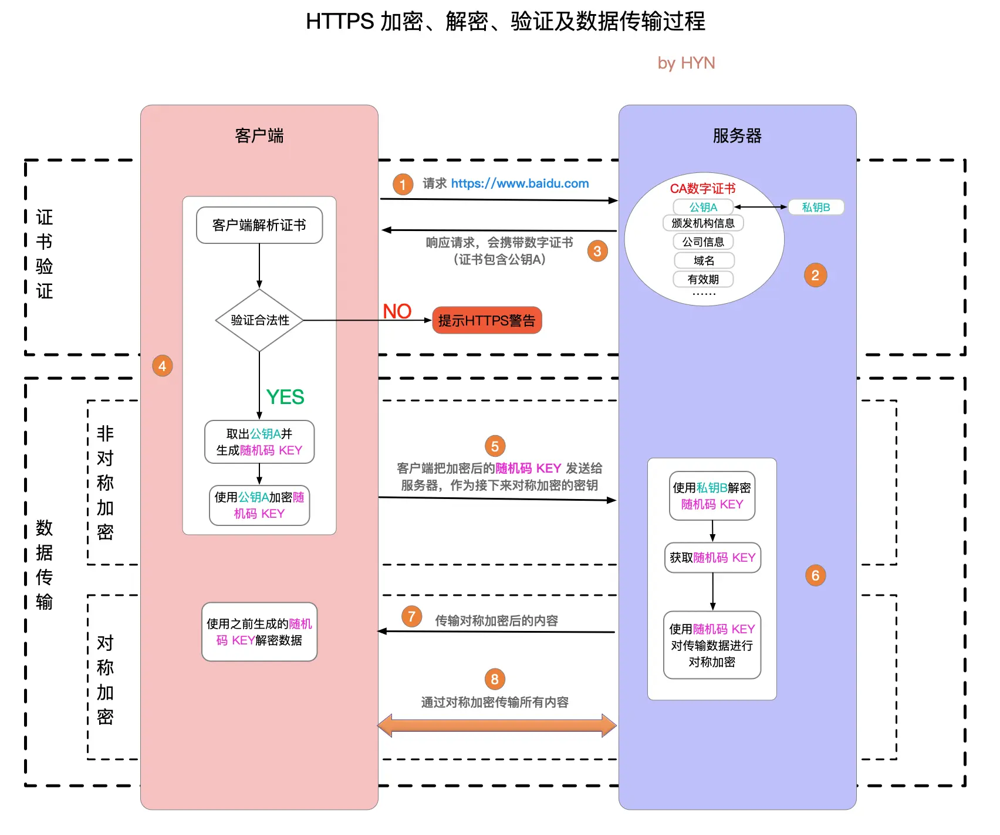

# 后端面经


## 操作系统

操作系统是计算机硬件和应用软件的中间层系统软件。主要功能包括进程管理、内存管理、文件系统管理、设备管理等

进程是操作系统分配资源的基本单位，线程是CPU调度的基本单位。一个进程可以包含多个线程，线程共享进程的资源。

进程间通信方式（Inter-Process Communication, IPC）：管道、消息队列、共享内存、信号量、套接字、信号

PCB(Process Control Block)：进程控制块，OS用于管理进程的数据结构（进程ID、状态、程序计数器、CPU寄存器等）

进程状态：创建、结束、就绪、运行、阻塞

线程同步方式：信号量、互斥锁、管道

孤儿进程：父进程退出，子进程还在运行，它们将被init进程回收（Linux中可以用top命令查找）

僵尸进程：子进程退出，父进程没有用wait/waitpid获取子进程状态，进程描述符仍然存在（Linux中可以用top命令查找）。

守护进程：在后台运行的进程，通常用于提供服务

并发和并行：并发表示一段时间内多个任务都会被切换处理；并行则是真正的多任务同时执行

常见进程调度算法：先来先服务、短作业优先、时间片轮转、优先级调度、多级反馈队列调度（目前使用）

临界区是访问共享资源的代码段

死锁条件：互斥、占有并保持、非抢占条件、循环等待。避免死锁：设置资源有序分配，设置超时让出等

> 举例：哲学家就餐问题

同步和异步：顺序执行和并发执行

有了进程为什么还要有线程：如果只有进程阻塞后就没法提供其他服务了

线程间共享资源：堆区、全局变量和静态变量、文件等

线程上下文：栈区指针、寄存器、程序计数器

* 使用多进程情况：高隔离性，CPU密集型
* 使用多线程情况：快速切换，I/O密集型


内核态和用户态能访问的地址空间不同（前者全部、后者部分）安全考虑

用户态切换到内核态：系统调用、异常、外部中断

系统调用是应用程序请求操作系统服务的接口，如文件操作、进程管理、网络通信等(fork, open, read, write)

用户进程地址空间分为代码段、数据段、堆栈段。


内部内存碎片（分配内存未完全使用） & 外部内存碎片（分配内存块有间隙）

页面置换算法：FIFO(First-In First-Out), LRU(Least Recently Used)最近最久未使用（应用较多）, LFU(Least Frequently Used)使用频率最少

虚拟内存作用：

* 提供超过系统物理内存的可用内存，部分内存与磁盘互换（缺页中断）
* 隔离进程，提高内存使用安全性，防止操作到系统运行必需内存
* 提高内存利用率，仅加载一份操作系统动态库，仅将进程正在使用的数据和指令载入物理内存

> 页表的存储和管理需要占用一定的内存空间；地址转换过程增加了系统的开销。
>
> 多级页表能减少内存占用，提高访问效率
>
> TLB就是页表的缓存，利用了时空局部性

MMU(Memory Management Unit)：负责虚拟地址和物理地址之间的映射关系

* 分段
  * 段大小不等，且有实际意义：主程序段、栈段、子程序段等等，容易导致外部碎片
  * 虚拟地址：段号+段内偏移量；segment table: 段号+该段起始物理地址
* 分页（流行）
  * 为防止页表过大，一般采用多级页表（64位系统为四级页表），用时间换空间。
  * 分页可能出现内部碎片
  * TLB(Translation Lookaside Buffer)：利用局部性的快表
* 段页：先按段划分再按页划分。分页是为了提高内存利用率实现虚拟内存；分段是便于程序独立


软链接：快捷方式，指向文件地址；硬链接：inode信息，实质是文件别名，修改会同步。

磁盘调度算法：先来先服务；最短寻道时间优先；扫描；循环扫描（只按照一个方向）；LOOK（提前结束扫描）；C-LOOK

虚拟机将计算机虚拟到硬件层；容器只虚拟到操作系统以上的软件层。

```bash
# Linux常见命令
# 状态
top
ps aux | grep
# 可与grep配合查看某端口连接数和状态
netstat
ping
ifconfig
wget
kill -9 PID
df
# 显示目录磁盘使用情况
du
# 显示内存和交换空间使用情况
free
# 文件相关
pwd
mkdir
rm
mv
# rwxa421ugo
chmod
find . -name "a.txt"
unzip
tar
# 定期执行指定命令，并将结果实时显示到终端中，默认2秒1次
# 可与netstat结合查看特定端口qps
watch
```

多路复用：通过单个线程同时监控多个I/O流，通过就绪通知避免阻塞等待

Linux I/O多路复用的三种机制

* select：fd_set（bit_map）数组存储文件描述符集合，select内核会遍历fd。（文件描述符最大1024，用户态拷贝到内核态）
* poll：poll_fd（结构体数组，大小理论上仅受机器内存限制）链表存储文件描述符集合，同样需要拷贝和遍历，但文件描述符不限
* epoll（目前Linux使用）：使用 `epoll_wait` 等待文件描述符就绪，内核通过回调机制直接通知就绪的文件描述符（有通知一次（边缘触发）和一直通知（水平触发）的区别）。文件描述符数量没有限制（红黑树存储），内存映射（mmap），减少用户态和内核态的拷贝

Load Average：反映系统负载，一段时间内平均有多少个正在处理和等待被调度的进程（过去1min, 5min, 15min）大于CPU核心数则意味着系统繁忙

文件系统在磁盘中的组织结构：（不同文件系统FAT32/ext4/NTFS细节不一样）

* 超级块：磁盘起始位置，全局信息，文件系统类型、大小、块大小、空闲块数量
* 目录结构：存储文件名与Inode的映射关系。
* 空闲空间管理：位图或者空闲块链表
* Inode：存储文件或目录的元数据，支持硬链接
* 数据块：4KB一块
* 日志：记录文件系统的操作日志，用于崩溃恢复。

内核类型

* 宏内核：功能集成，如Linux。性能高但复杂性高
* 微内核：仅保留核心功能在内核（基本的进程和内存管理），其他在用户态运行，用IPC通信。如Windows。性能低但安全稳定

## 计算机网络

OSI模型：七层网络模型，包括物理层（报头和起始帧分界符 & 检测错误的帧校验序列）、数据链路层（交换机，MAC地址）、网络层、传输层、会话层、表示层（数据转换压缩和加密）和应用层。（理论模型）

> 交换机端口不具有MAC地址，MAC地址表记录LAN中MAC地址和交换机端口的映射关系
>
> 路由器各个端口都有MAC地址的IP地址，相当于网卡，发送时会替换MAC地址，但IP地址不变

TCP/IP模型：四层模型，包括网络接口层（Ethernet/WiFi, 48位MAC包头）、网际层（IP）、传输层（TCP/UDP）和应用层。（实际应用模型）

从上至下层层封装，从下至上层层解封

> 常见应用层服务：HTTP80, HTTPS443, DNS53, FTP21, SSH22

TCP是面向连接的协议，面向字节流（会分段），提供可靠的数据传输，保证数据顺序和完整性；UDP是无连接的协议，面向报文段（只加UDP头），传输速度快但不保证可靠性（直播、视频、电话等）。

> 让UDP可靠：应用层重现TCP功能，序列号、ACK、超时重传
>
> TCP首部没有数据长度字段（面向字节流），IP和UDP有

> * 流量控制：确保发送方的发送速率不会超过接收方的处理能力。通过滑动窗口协议的窗口大小控制
> * 拥塞控制：防止网络中因为报文过多而拥塞。通过拥塞窗口和算法（慢启动、拥塞避免、快速重传、快速恢复）控制
>   * 快速重传：收到三个及以上重复ACK即认为报文丢失，而非等到超时
>   * 快速恢复：快速重传后，拥塞窗口减半，线性增长

TCP的三次握手和四次挥手

- **三次握手**：客户端发送SYN，服务器回复SYN-ACK，客户端发送ACK和数据，建立连接。确保双方的发送和接收能力正常，防止已失效的连接请求到达服务器
  - 握手时状态：CLOSED, LISTEN, SYN_SENT, SYN_RCVD, ESTABLISHED

- **四次挥手**：客户端发送FIN，服务器回复ACK，服务器发送FIN，客户端回复ACK，关闭连接。全双工协议，双方需要分别关闭自己的发送和接收通道。
  - 服务器收到关闭连接请求进入的CLOSED_WAIT状态，是为了保证数据传完
  - 最后客户端需要等待2MSL（TIME_WAIT状态）再进入CLOSED状态，防止ACK服务器未收到需要重传
  - 挥手时状态：FIN_WAIT1, CLOSED_WAIT, FIN_WAIT2, LAST_ACK, TIME_WAIT, CLOSE

HTTP是明文传输，HTTPS通过SSL/TLS加密传输。使用非对称加密（如RSA）交换对称加密密钥，然后用对称加密（如AES）传输数据。CA（Certificate Authority）证书防止中间人攻击



常见对称加密算法（使用同一密钥进行加密解密，速度快适合加密大量数据）

* AES(Advanced Encryption Standard)：密钥长度128/192/256位，应用最广泛且安全性高（TLS和磁盘加密等）
* DES：56位密钥长度，目前已不够安全，能够暴力破解
* 3DES：DES改进版，但逐渐被AES取代
* ChaCha20：Google的流加密算法，移动端性能优异

常见非对称加密算法（公钥加密私钥解密，安全性高但速度慢，适合密钥交换和数字签名）

* RSA：基于大素数的分解问题，对计算机非常困难
* ECC（Elliptic Curve Cryptography）：基于椭圆曲线离散对数问题，用于移动端加密和数字货币

> CA证书：用于验证公钥合法性和持有者身份
>
> 字段包括版本号、签名算法、颁发者、有效期、主体、公钥（最重要）、签名（验证证书真实完整）
>
> 数字签名：私钥加密，公钥验证。身份认证、数据完整、不可否认

DNS解析过程：浏览器缓存 → 操作系统缓存 → 本地DNS服务器 → 根域名服务器 → 顶级域名服务器 → 权威域名服务器 → HTTP请求建立TCP连接 → 服务器返回HTTP相应数据 → 浏览器解析HTML内容，构建DOM树，渲染画面

* DNS解析优化：缓存、负载均衡（多个IP）、CDN

* DNS安全问题：DNS劫持（攻击者篡改DNS解析结果，导向恶意网站）；DNS污染（伪造DNS响应干扰正常解析）；使用HTTPS防护

DNS记录类型

- **A记录**：将域名解析为IPv4地址。
- **AAAA记录**：将域名解析为IPv6地址。
- **CNAME记录**：将域名指向另一个域名（别名）。
- **MX记录**：指定邮件服务器的地址。
- **NS记录**：指定域名服务器。

IPv4和IPv6通过子网掩码划分网络地址和主机地址。

常见的负载均衡算法：轮询、加权轮询、加权随机、最少连接、IP哈希

Socket: IP + 端口 + 协议 的接口 & WebSocket: 基于TCP的应用层通信协议

从上到下：Socket库 - TCP/UDP + IP - 网卡驱动 + 网卡


抓包：Chrome console network面板，Wireshark抓包

HTTP状态码

* 1xx：服务器收到请求，但需要进一步操作
* 2xx：请求成功处理
* 3xx：重定向
* 4xx：客户端错误
* 5xx：服务端错误

> 幂等：对同一资源执行该操作一次和执行多次的效果相同。

CDN（内容分发网络）是将静态资源缓存到离用户更近的服务器，以加速访问。优点：加速访问、减轻源服务器压力；缺点：成本较高、缓存一致性需要管理。

常见网络攻击

* DDoS（分布式拒绝服务攻击）是通过大量请求耗尽服务器资源，使其无法正常服务，比如SYN洪泛攻击。防御：使用CDN、防火墙、限流、IP黑名单
* SQL注入攻击：通过input框输入sql脚本从而非法获取信息。防御：对用户输入进行转义

* XSS（跨站脚本攻击）是通过注入恶意脚本，窃取用户信息或劫持会话。防御：对用户输入进行转义

* CSRF（跨站请求伪造）是通过诱导访问恶意网站盗用cookie，执行未经授权的操作。防御：使用Token验证、检查Referer头

常见网络协议

* WebSocket是一种全双工通信协议，允许客户端和服务器实时通信。长连接，应用于实时场景（在线聊天、游戏、股票）

* NAT（网络地址转换）是将私有IP地址转换为公有IP地址，以解决IPv4地址不足的问题。

* VPN（虚拟专用网络）是通过加密技术在公共网络上建立私有网络，提供安全访问。
* ARP / RARP（Address Resolution Protocol）：负责IP地址和MAC地址的转换
  * `arp -a`查看本地 ARP 缓存中的 IP-MAC 映射
  * nmap扫描局域网，获取设备的 IP 和 MAC 地址
* ICMP协议：用于网络诊断（如ping协议）
* ARQ协议（Automatic Repeat-reQuest）：数据链路层和传输层的错误纠正协议，通过确认和超时机制

RESTful API是一种基于HTTP协议的API设计风格，使用HTTP方法（如GET、POST、PUT、DELETE）操作资源。

> 一般GET参数在query上不能存隐私数据，GET会被浏览器缓存，且它幂等

URL时URI的子集

* HTTP1.0默认短连接，引入缓存控制Expire头
* HTTP1.1默认长连接（Connection: keep-alive），range头部允许返回部分资源
* HTTP2.0默认多路复用（最广泛，一个TCP连接允许多个HTTP连接），通过request id区分，基于二进制和头部压缩，服务器推送等功能
* HTTP3基于UDP的QUIC协议

> HTTP无状态：请求之间独立，状态由cookie / session / token保存
>
> * cookie：保存在客户端浏览器的小块数据（长时间）最多4K，在请求头Cookie字段中，自动发送
>   * 广告商在页面嵌入脚本设置了第三方Cookie，同步到广告网络中实时竞价；或不同平台与广告商有信息共享机制
> * session：服务器记录的一次会话（短时间）可以放在参数或header中
> * token：保存在内存中，手动发送，相比cookie不易受CSRF攻击

反向代理是服务器端代理，接收客户端请求并转发到后端服务器，隐藏真实服务器信息。

HTTP连接池：减少频繁创建和关闭连接（TCP三次握手和四次挥手）的开销

* 一个端口能否同时绑定TCP和UDP

可以，比如 DNS（域名系统）需要同时支持 TCP 和 UDP 查询

* 为什么有了MAC地址还需要IP地址

MAC地址是硬件地址，唯一，用于LAN中（第二层），在数据链路层中，只在LAN中有效。路由器在转发数据包时会剥离原MAC地址，改为路由器的MAC地址

IP地址是逻辑地址，可由DHCP动态分配，用于WAN中（第三层），在网络层，用于寻址、路由、分片

多线程下载数据：分块下载，HEAD请求获取文件总大小，设置Range字段指定下载字节区间

TCP粘包和拆包：多个小包可能会封装成一个，完整的包可能会拆成多个（和套接字缓冲区相关）可以设置消息边界\n

TCP报文头：源端口、目的端口、序列号、确认号、状态位、窗口大小、校验和

MTU(Maximum Transmission Unit): 一般1500字节；MSS(Maximum Segment Size): 去除IP和TCP报文头的数据最大长度

通过IP报文头的标识和分片偏移重新组合，IP分片服务于UDP，和TCP分段是两回事

LAN中防止频率碰撞：无线网中使用CSMA/CA协议载波侦听（发送前先监听）随机退避（信道繁忙则等待随机事件）确认机制（发送设备返回ACK后才确认无碰撞）

SDN：软件定义网络，将网络的控制平面（Control Plane）与数据平面（Data Plane）分离，通过集中化的控制器（Controller）来动态管理和配置网络设备。广泛应用于数据中心和网络虚拟化

TTL(Time To Live)：IP包被路由器丢弃前允许通过的最大网段数量，限制数据包的存活时间

## 系统设计

什么是微服务？

* 软件由通过明确定义的 API 进行通信的小型独立服务组成。解耦更强、易于扩展和开发

微服务缺点？

* 系统复杂性增加
* 服务间通信开销
* 分布式的一致性

微服务架构组件？

* 注册中心：用于服务的注册与发现，管理微服务的地址信息。
* 配置中心：用于集中管理微服务的配置信息，可以动态修改配置而不需要重启服务。
* 远程调用：用于在不同的微服务之间进行通信和协作。
* API 网关：作为微服务架构的入口，统一暴露服务，并提供路由、负载均衡、安全认证等功能。
* 分布式事务：保证跨多个微服务的一致性和原子性操作。
* 熔断器：用于防止微服务之间的故障扩散，提高系统的容错能力。
* 限流和降级：用于防止微服务过载，对请求进行限制和降级处理。
* 分布式追踪和监控：用于跟踪和监控微服务的请求流程和性能指标。
  * Prometheus定期拉取微服务指标，存储时间序列数据 + Grafana可视化仪表盘工具
  * ELK日志收集方案：ElasticSearch检索，Logstash收集，Kibana可视化

什么是服务发现？

* 数据库有张服务表，配合负载均衡来登记注销服务和提供服务

什么是跨域问题？

* 浏览器有同源策略作为安全机制，源：域名+协议+端口
* 本质上改后端设置CORS响应头Access-Control-Allow-Origin为*；或者使用nginx服务器，由nginx进行转发
* websocket不受同源策略限制

什么是优雅启动和停止

* 不可以关闭连接
* 新的进程启动并接管旧的进程请求
* 旧进程处理完后退出（chan通信，defer扫尾）

池化：内存池、线程池、连接池、对象池

* 创建和销毁涉及大量系统调用和网络IO
* 内存池：快速分配内存、降低内存碎片率、减少维护内存的额外空间
* 线程池：Manager, Worker, Task, TaskQueue
* 连接池：数据库连接包括TCP连接、数据库权限认证、执行语句、断开数据库连接TCP连接

消息队列：服务解耦、异步处理、流量控制

* 作为中间层，让下游服务订阅事件，把同步变成异步

> RPC(Remote Procedure Call)：远程过程调用。允许程序调用远程机器进程中的函数，就像调用本地函数一样。常用的RPC框架比如gRPC，基于HTTP/2实现，使用protobuf作为序列化机制而非json

序列化解决对象持久化和跨网络数据交换的问题：

* 文本类型：JSON/XML，可读性强，但信息密度低，占空间大
* 二进制类型：Protocol Buffer, Thrift。信息紧凑但基本不可读

TCP连接本质是操作系统内核的socket对象，一个服务器进程通常监听一个端口号，每个TCP连接需要占用一定的内存和CPU资源

流量高峰处理方案

* 云服务器水平弹性扩展，负载均衡分配到多台服务器
* 本地使用Redis缓存热点数据，CDN缓存静态资源
* 限流控制请求速率，降级在高峰期关闭非核心功能
* 耗时操作发给消息队列等待异步处理

常用限流或降级算法

* 固定时间窗口计数：无法应对突发激增流量
* 滑动窗口计数，划分时间片统计请求总和：可以应对边界激增流量（窗口快速缩小），算法需要空间容量
* 漏桶算法：服务方按固定速率从通中取请求并执行：所有请求都得等
* 令牌桶算法：维护一个固定速率添加的固定容量令牌桶，请求消耗令牌进行处理（目前使用较多）

常见设计模式（软件设计中常见问题的经典解决方案模版，相比算法描述层次更抽象）

* 单例模式：一个类只有一个实例，并提供全局访问点获取
* 工厂模式：定义一个创建对象的接口，但由子类决定实例化哪个类。
* 装饰器模式：动态地给对象添加额外的职责，而不改变其结构
* 发布订阅模式：一对多依赖关系，当一个对象改变状态时，所有依赖它的对象都会收到通知并自动更新。
* 策略模式：定义一系列算法，将每个算法封装起来，并使它们可以互相替换。

常见通信协议

* RPC（Remote Procedure Call）：让调用远程服务像调用本地函数一样
  * 基于相同的二进制协议（gRPC或Protobuf）支持双向通信，性能更优，主要用于微服务、分布式系统、实时通信
* HTTP（Hypertext Transfer Protocol）：通用数据传输，主要用于Web应用

## 其他后端组件

Hadoop非常擅长处理非结构化数据，比如文本文档、日志文件、图像、音频和视频等，使用HDFS和Map/Reduce。也可以处理结构化数据（关系型数据库的表格）和半结构化数据（XML/JSON）。Hadoop适合批处理和大规模数据分析，响应时间较长。

Map/Reduce: 分而治之

* Map映射：减少数据规模，就近分配节点，提供并行计算
* Reduce化简：汇总结果

> Hadoop生态和MySQL/MongoDB/Redis的区别主要在应用场景的不同：离线 vs. 在线。响应实时性的差异。

Zookeeper: 分布式协调服务，负责管理协调分布式系统中的节点

* Kafka：LinkedIn开源的分布式消息队列系统，构建实时数据管道和流处理应用，用于异步通信、解耦系统、流量削峰等。发布订阅设计模式
* RocketMQ：Alibaba开源的分布式消息队列系统，专注于高可用、高性能、事务。吞吐量略逊于Kafka，但可靠性更好

ELK：用于构建可视化的日志分析管理系统

* Elasticsearch：实时搜索和分析大规模数据
* Logstash：数据采集和转换
* Kibana：数据可视化和仪表盘

Ceph：分布式存储系统，提供对象存储、块存储和文件存储。算是Hadoop的竞品。

Git的版本管理模型是围绕快照（snapshot）构建的。每次提交（commit）都会记录当前所有文件的快照，包括文件内容和目录结构的状态。

clone, init, status, add, commit, log, checkout, pull

* git merge：保留分叉所有历史，git树上显示先分叉再合并
* git rebase：原分支应用所有分叉分支的修改，git树上只有一条分支


## K8s

etcd(/etc + distributed): 一致且高可用的分布式键值存储，作为K8S的后台数据库，通常部署奇数个。完全复制，每秒一万次写入，gRPC调用，raft算法实现强一致。