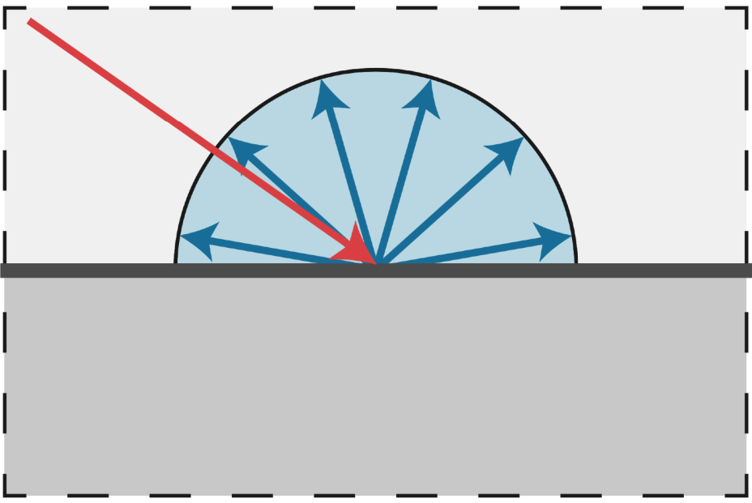
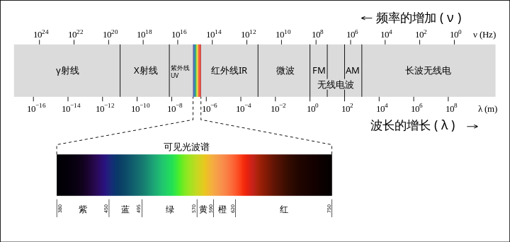

# GAMES101

## Lexture 17: Material and Appearance(材质和外观)

path tracing（路径追踪）：三维CG渲染算法，模拟光的多次弹射（反射/折射等）计算场景光照效果。核心源于光学和蒙特卡洛方法。使用蒙特卡洛积分：发射大量随机样本光线并统计平均结果来逼近真实光照。

BRDF(Bidirectional Reflectance Distribution Function，双向反射分布函数)：描述光线入射到表面后在各个出射方向的能量分布情况。

Lambertian / Diffuse反射：假设材质表面均匀且无光泽，不会有明显高光或镜面反射，描述均匀漫反射

### 光学基础

光是一种电磁波，具有波粒二象性。频率越高能量越高。

可见光波长400-700nm

反射：光线遇到另一介质返回原介质。反射线/入射线/法线在同一平面，反射线与入射线在法线两侧，反射角等于入射角

折射：穿过不同密度介质时的偏折

散射

干涉：多束光波的相互影响，发生相长干涉（光强加强）和相消干涉（光强减弱），形成明暗相间的干涉图样

色散：光通过某些透明材料时，不同波长光因为折射率不同而分离，形成彩虹光谱

吸收：部分能量被物质吸收导致光强减弱

衍射

偏振

泊松斑

双折射

全内反射：光线从密度较高介质到密度较低介质且入射角大于临界角时，只有反射没有折射（光纤）

光电效应