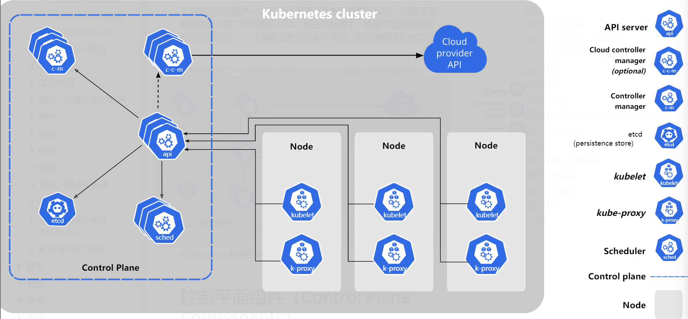
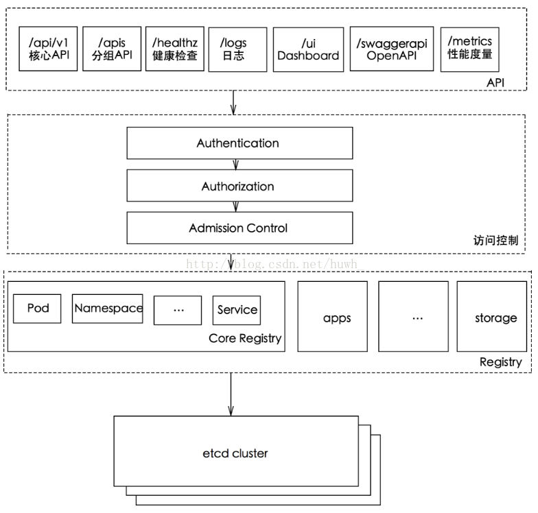

## 基础知识

Kubernetes: 开源容器编排系统，功能包括创建应用，部署应用，提供服务，负载均衡，扩容缩容，应用更新，故障监测等等

> 单机时代到集群时代的演变

K8S的缺点：安装和配置困难且复杂，管理繁琐，编译和运行耗时很长，大部分简单应用不需要Kubernetes

K8s架构：



### Control Plane / Master

高可用生产环境至少需要三个Node，minikube可用于本地学习开发

- kube-api-server: 提供RESTful API的统一访问入口，实现认证Authentication（你是谁），授权Authorization（你能做什么），准入控制Admission Control（具体审查）等功能。其他组件数据交互和通信的枢纽。
  - 8080(http, 默认)和6443(https)
  - K8s支持多个API版本，每个版本都在不同的路径下，每次请求需要找到适当的API组和API版本，api-server在/apis下公开了OpenAPI格式的规范文档（缓存在~/.kube/cache中），这个过程为版本协商。



- kube-controller-manager
    - Node Controller（节点故障通知与响应）
    - Job Controller（检测Job并创建Pod来运行）
    - Endpoint Controller（管理 Service 和 Pod 的映射关系）
    - ServiceAccount Controller（为新命名空间创建默认的服务账号）
    - ReplicaSet Controller（RC，保证集群中存在指定数量的Pod副本，现在更推荐使用ReplicaSet和Deployment来管理副本）
    - Deployment Controller（管理 Deployment 资源，提供声明式更新，支持滚动更新、回滚和扩缩容）
- kebe-scheduler: 监视新创建的未指定Node的Pod，计算出合适的Node绑定Pod
- etcd: 一致且高可用的分布式键值存储，作为K8S的状态信息后台数据库，通常部署奇数个。完全复制，每秒一万次写入，gRPC调用，raft算法实现强一致。
- cloud-control-manager: 将 Kubernetes 核心代码与特定云提供商的集成逻辑解耦，主要控制器如下
    - Node Controller: 从云平台获取节点信息（地址、主机名）、打上云平台特定的标签（如区域、实例类型），并在云上节点被删除时清理K8s中的Node对象
    - Service Controller: 当创建 Type=LoadBalancer的Service时，负责与云平台交互，自动创建、配置和管理云负载均衡器
    - Route Controller: 负责在云平台上配置路由规则，确保集群内不同节点上的Pod能够相互通信

- kubectl：K8s客户端命令行工具

Watch: 监听；Reconciliation: 调和向期望状态演进；Lease：租约检测活性

### Node(Pod的宿主机)：

- kubelet: 启动时向api-server进行注册并定时汇报本节点信息，保证containers运行在Pod中，接收PodSpec，连接Control Plane和Node的桥梁，通过CRI(Container Runtime Interface)创建/更新/删除容器
  - 用Metrics Server提供核心指标，启用**cAdvisor**组件实时采集容器指标和资源数据，默认端口号4194
  - Liveness Probe: 判断容器是否Running，如果不是则杀死容器
  - Readiness Probe: 判断容器服务是否可用，如果不可用则将对应service从endpoint列表中移除
  - Startup Probe：启动时运行一次，检测容器是否已成功启动并可用
- kube-proxy: 维护节点网络规则，负载均衡，监听api-server
  - iptables：为防火墙设计（默认采用），可手动添加规则
  - IPVS：专用于高性能负载均衡
- container-runtime: 管理容器执行和生命周期，最流行的是Docker Engine（最新k8s已弃用Docker改用containerd或CRI-O）
- Pod: k8s创建和管理的最小单元，有IP地址，包含一个Pause容器和多个业务容器，一般一个Pod运行在一个Node上（但一个Node可以运行多个Pod），Pod内共享网络命名空间
  - Pause容器，作为父容器存在，持有网络命名空间和PID命名空间，维持Pod存活，最小化的Linux系统。
  - Pod中容器/应用的共享资源：PID命名空间，网络，能使用POSIX消息队列进行通信，共享主机名，IP地址，存储卷
  - 环境变量POD_NAME

### Addons & CRD:

插件，命名空间属于kube-system 

- DNS(Domain Name System)：A记录：域名指向IP；CNAME：域名指向域名。因此可以使得多个域名指向同个A记录，这样更改服务IP地址时只需要更改A记录即可，也方便流量管理。
- Dashboard
- 容器资源监控
- 集群层面日志
- 网络插件

自定义资源定义(Custom Resource Definition)

- ApisixRoute：Apache针对Ingress控制器的CRD，专为APISIX网关一起使用设计

### K8s常见对象

- Label：键值对，附加到各种资源对象上（比如Node，Pod，Service）
- Deployment(包含ReplicaSet，代替原来的Replication Controller): 最常见于管理无状态应用
- StatefulSet: 管理多个不同身份ID的Pod，最常见用于建立Pod和持久化存储的关联
- DaemenSet: 确保节点上运行一个Pod副本，部署系统服务比如日志，在特定节点上提供本地设施，比如允许某节点访问本地GPU。一般用于每个节点的日志收集和状态监控。
- Job: 一次性任务，创建并启动若干个Pod，成功后清除Pod
- CronJob: 定时任务
- Service：具有唯一的cluster ip:port（也可通过DNS解析），在K8s内部由一组Pod（Endpoints）一致提供（负载均衡+故障恢复保证高可用性），通过labels和selectors关联
- Ingress：接入外部流量的反向代理的API对象，规定HTTP/HTTPS应该被转发到哪个Service上。可用于路由，TLS加密，负载均衡，Ingress Controller以Pod形式运行
  - Service对内暴露服务，Ingress对外暴露服务
- Heapster：K8s原生集群监控方案，以Pod形式运行发现节点从kubelet上获取监控数据。

常见的存储卷：

- emptyDir：存储临时数据的简单空目录
- configMap：非敏感的配置文件
- secret：账号密码，OAuth Tokens，SSH Keys等敏感信息
- Persistent Volume Claim：存储卷声明
- 网络存储卷

Persistent Volume的访问模式：

- ReadWriteOnce(RWO): 允许单个节点读写
- ReadOnlyMany(ROX): 允许多个节点只读
- ReadWriteMany(RWX): 允许多个节点读写

### K8s相关术语

flannel：K8S中提供overlay网络的工具，有多种实现方式：VXLAN, UDP, host-gw等

EFK: k8s日志系统集中化管理方案

- Elasticsearch：搜索引擎，负责存储日志并提供查询接口
- Fluentd：负责从k8s上node搜集日志并发送给Elastic Search
- Kibana：提供WebUI

Helm: k8s软件包管理工具，每个包为chart，为一个目录。

Minikube: for learning and developing in the local environment

### kubectl命令

Kubectl: Kubernetes command line interface

```Bash
kubectl action resource
kubectl version
kubectl get nodes/deplotments/pods
kubectl create deployment kubernetes-bootcamp --image=gcr.io/google-samples/kubernetes-bootcamp:v1
# 开启代理连接集群内部网络
kubectl proxy
kubectl describe pods
kubectl logs "$POD_NAME"
kubectl exec -ti $POD_NAME -- bash
```

kebectl drain：从服务中安全地移除一个Node，遵守PodDisruptionBudgets然后去除Pod，进行维护操作

## 过程理解

Pod生命周期：

- Pending（Pod已创建，但镜像还未创建）
- Running（容器已创建，且至少一个在运行）
- Succeed（容器已退出且不再重启）
- Failed（容器已退出，至少有一容器退出失败）
- Unknown（api-server无法获取Pod状态，比如网络问题）

Pod创建流程：

1. 用户通过kubectl / api客户端工具提交需要创建的Pod信息给api-server
2. api-server验证客户端用户权限，通过后创建请求生成Pod对象，信息存入etcd，返回确认信息给客户端
3. api-server反馈etcd中Pod对象的变化，其他组件watch
4. scheduler根据Pod的limits（最大使用）和requests（启动需要）计算合适的node，包括预选和优选两阶段，发送信息给api-server
5. node上的kubelet发现api-server有Pod调度到本节点，尝试用docker启动容器，并将结果反馈到api-server
6. api-server更新Pod状态到etcd

Pod终止流程：

1. 用户向api-server发送删除Pod对象命令
2. api-server在宽限期内（30s default）将Pod视为Dead
3. 将Pod标记为terminating
4. kubectl监控到terminating Pod时启动Pod关闭流程
5. endpoint controller将匹配到此service对应资源endpoint列表（包含Pod的IP和端口）中删除
6. 以同步方式执行preStop钩子处理器
7. Pod中进程收到信息
8. 宽限期结束后如果还存在立即终止
9. 宽限期设为0，完成删除操作

Pod pending状态排查：用kubectl describe查看pod的events，一般原因包括：

- scheduler无法为pod分配一个合适的node：node的cpu或内存等资源不满足要求，违反亲和性或反亲和性
  - Affinity和Anti-Affinity：有硬性和软性，分别表示要求和偏好，比如应用Pod和数据库Pod分离，同一服务的多个实例分布在不同节点等
- PV或PVC无法动态创建
  - 底层存储可以是各种类型：NFS, Ceph, iSCSI，K8S会抽象成PV(Persistent Volume)，Pod定义的存储卷实际是PVC(Persistent Volume Claim，持久卷请求)，PVC会绑定具体的PV
  - PV生命周期Provisioning(配置)，Binding(PVC和PV的绑定过程)，Using，Releasing(Pod被删除或停止使用该PV)，Reclaiming(擦除或重用)
  - PV状态：Available, Bound, Released, Failed

Service类型

- ClusterIP：仅供集群内部使用，一般通过Ingress接入外部流量
- NodePort：对外访问IP:PORT
- LoadBalancer：需要外部云厂商支持，有公网IP
- ExternalName：将集群外Service引入集群内

init container：按照定义顺序运行（失败则重启），完成应用容器启动所需要的前置条件。

Deployment的更新升级策略：

- Recreate（杀死Pod再重新创建）
- RollingUpdate（逐渐更新，maxUnavailable和maxSurge）

pv的回收策略：

- retain保留（允许管理员手动回收PV）
- delete删除

PV扩容：allowVolumeExpansion: true，允许用户修改pvc申请存储空间完成pv扩容

k8s调度方式：

- Deployment / RC
- NodeSelector：定向调度，匹配Pod的nodeSelector和Node的label
- NodeAffinity：硬规则和软规则（权重供scheduler参考）
- Taints和Toleration：Taint使Node拒绝特定Pod，Toleration使Pod容忍Taint的Node

Service分发后端策略：RoundRobin(轮询后端Pod，默认)，SessionAffinity(基于客户端IP保持对应请求到同一Pod)

Headless Service：需要人为指定负载均衡器，不设置入口ClusterIP，仅通过Label Selector返回Pod列表，比如redis集群

镜像下载策略：Always, Never, IfNotPresent

K8s的PodSecurityPolicy：

- 是否允许Pod以priviledged模型运行
- 是否允许Pod访问宿主机资源
- 容器内进程是否可以提升权限
- SELinux相关配置

Minikube practice experience

## 其他术语

**raft算法**：分布式一致性算法，核心机制包括leader election（系统节点分为leader, follower和candidate），log replication（leader接收客户端请求，并将操作记录到日志中，随后复制到follower中，只有超过半数节点复制日志后才返回成功），日志只能由leader发起追加。leader需要定期发送心跳消息防止超时触发选举

- **gRPC**(Google Remote Procedure Call)：服务间调用。开源&高性能（使用Protocol Buffer进行二进制序列化，支持双工通信），基于HTTP/2
- **RESTful** **API**：前端调用后端服务的web API，无状态，基于JSON/XML

**Stateless / Stateful Application**：应用的**状态**取决于是否需要维护**会话信息或数据状态**，如果无状态，则请求可以被任何实例处理

存储类型：

- **NFS**(Network File System): 网络文件系统，文件级别共享与协作
- **Ceph**: 更全面的分布式存储解决方案，支持持块存储，对象存储和文件系统服务
- **iSCSI**(Internet Small Computer System Interface): 直接访问存储块

**SELinux**(Security-Enhanced Linux)：更注重系统安全的Linux，实施强制访问控制（Mandatory Access Control）来限制程序对系统资源的访问，涉及domain, type, role, level。运行模式包括enforcing(阻止任何违反策略的行为)，permissive(仅记录违反策略的操作)，disabled

分布式系统的**脑裂**现象：由于网络分区等问题导致系统被分割成多个独立运行的部分，彼此无法感知对方。可能导致数据不一致，服务冲突，资源竞争，重复处理等问题。

**VIP**(Virtual IP Address)：常用于负载均衡等网络服务，流量被定向到多个实际服务器

**VRRP**(Virtual Router Redundancy Protocol)：虚拟路由器冗余协议，用于LAN的容错协议，提供一个虚拟路由器来规避单点故障。由一个Master和多个Backup构成，共享一个虚拟IP和一个虚拟MAC。选举过程基于优先级和实际IP，Master定期发送VRRP通告告知Backup它仍在活动

**keepalive**允许客户端和服务器之间基于一个TCP连接发送多个HTTP请求

**Docker Swarm**：Docker官方提供的容器编排和集群管理工具。一般认为在功能丰富性和生态系统成熟度方面不如K8s，但K8s也更复杂，后者往往是首选。

**OpenvSwitch**：开源虚拟交换机

**Calico**：基于BGP的三层网络方案，每个Linux Kernel实现vRouter

**CSI**(Container Storage Interface) & **CNI**(Container Network Interface)

**RBAC**(Role-Based Access Control)：基于角色的访问控制，用户User通过成为角色Role来获取权限Permission